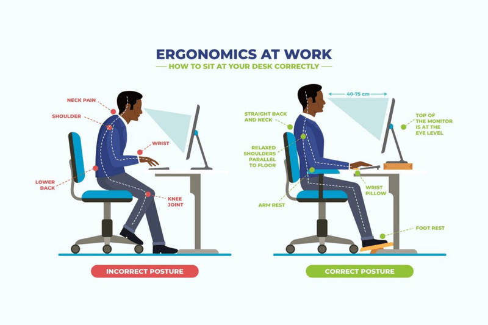

### What are the risks of using a laptop without an external monitor or keyboard?

Most CS students have bad posture nowadays. The frequent bad posture can cause back and shoulder pain. There is also a risk of neck strains from looking down at the screen all day.

If your wrist is at a weird or uncomfortable angle, it might cause wrist strain from typing.

A common risk of using a laptop without external monitor/keyboard are eye strains where you stare at the screen for quite a while.

### What ergonomic equipment can improve posture when working on a laptop? (e.g., laptop stands, external keyboards, ergonomic chairs)

- External keyboard & mouse allows neutral wrist/arm position.
- Footrest keeps feet flat if chair is too high.
- Laptop stands for elevation
- Ergonomic chair that supports natural spine curve.

### What adjustments should be made to monitor height, chair position, and desk setup for a healthier workspace?

- Keep frequently used items within easy reach.
- Desk height so elbows bend at approximately 90 degrees when typing.
- Chair position should be adjusted so knees are 90 degrees and feet are flat or needs to be comfortable

### What are some daily habits that reduce the impact of prolonged laptop use? (e.g., movement breaks, posture checks, eye strain reduction techniques)

- Mini breaks in between sessions. Maybe drink water or complete breathing exercises
- Regular posture checks
- Stretch wrists, neck, and shoulders throughout the day.

### What equipment changes can you make to improve your workspace setup? (e.g., using an external monitor, adjusting your chair, using a laptop stand)

In my current workspace setup, there is little room and my PC and monitor take up a majority of my space. Thus, a bigger desk would be sufficient here. Additionally, I can add a laptop stand and use an external keyboard + mouse.

### What behavioural changes can you implement to improve posture and reduce strain? (e.g., sitting upright, taking regular breaks, adjusting screen height)

A behaviour change I can implement and should commit to is straightening my back and correcting my posture. Sit upright with shoulders relaxed. This allows me to keep my posture correct at all times, especially during long coding sessions.

### How can you remind yourself to maintain good posture and take breaks throughout the day? (Hint: Use Focus Bear to schedule movement breaks!)

I have an idea....Use Focus Bear’s movement reminders to stand, stretch, or walk!

Or if I'm really into it, I can place a sticky note above my PC/desk

### Document at least one workspace change or habit adjustment you made

Placed a sticky note above my PC to STRAIGHTEN MY BACK AND CORRECT MY POSTURE!

### Example of a good workspace that applies ergonomic principles

This is an example of the workspace that applies ergonomic habits.

Embracing corporate ergonomics brings numerous advantages to all people. By prioritising the design of workspaces and equipment to fit the needs of individuals and productivity.