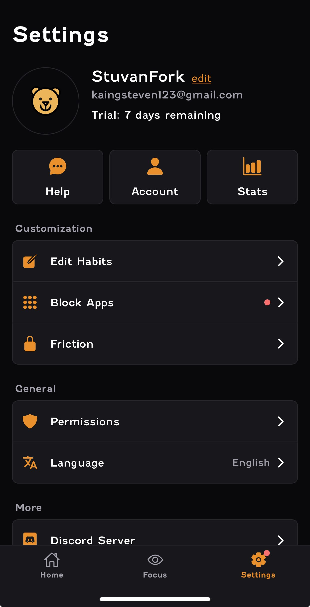
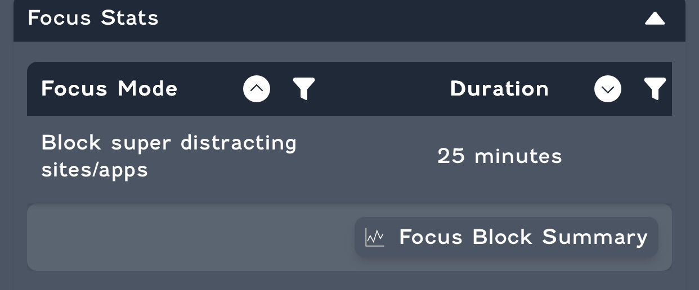

# Steven's Timetable

## Context

As a software engineering student at Monash University, I have a hectic schedule balancing academic commitments with other responsibilities including part-time work and passion projects. To ensure successful participation in the Focus Bear internship while maintaining my existing commitments, I have developed this comprehensive time management plan.

This detailed timetable addresses:

- Specific working days and time slots
- Exact duration of work sessions
- Designated work locations
- Weekly hour allocation

Note that the following may change a bit but it is always good to have a plan before hand to keep myself on track!

## Weekly Time Table Plan

| Day | Time Slot | Duration | Location | Hours | Notes |
|-----|-----------|----------|----------|-------|-------|
| **Monday** | 09:00 AM - 13:00 PM or 22:00 PM - 02:00 AM | 4 hours | Remote (Home Office, Melbourne VIC) | 4.0 | |
| **Tuesday** | - | - | - | 0.0 | University commitments/ Part-time |
| **Thursday** | 09:00 AM - 13:00 PM or 22:00 PM - 02:00 AM | 4 hours | Remote (Home Office, Melbourne VIC) | 4.0 ||
| **Friday** | - | - | - | 0.0 | University commitments/ Part-time |
| **Saturday** | - | - | - | 0.0 | University commitments/ Part-time |
| **Sunday** | 09:00 AM - 13:00 PM or 22:00 PM - 02:00 AM | 4 hours | Remote (Home Office, Melbourne VIC) | 4.0 ||

**Total Weekly Hours:** 10 - 16 hours

## Work Environment Setup

### Location Specifications (Based in Melbourne, Victoria)

- **Primary Location:** Dedicated home office space
- **Timezone:** Australian Eastern Standard Time (AEST/AEDT)

### Communication Availability

- **Response Time:** Within 2-4 hours during work days. Almost always responsive (Yes, I am chronically online and stay up pretty late sometimes)

## Schedule Considerations

### Flexibility Factors

- May require temporary schedule adjustments
- Potential for reduced hours during critical academic periods if necessary
- Potential for increased hours during the break

### The start of my focus bear session journey

---
