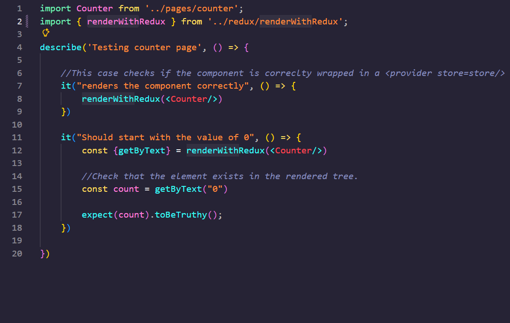
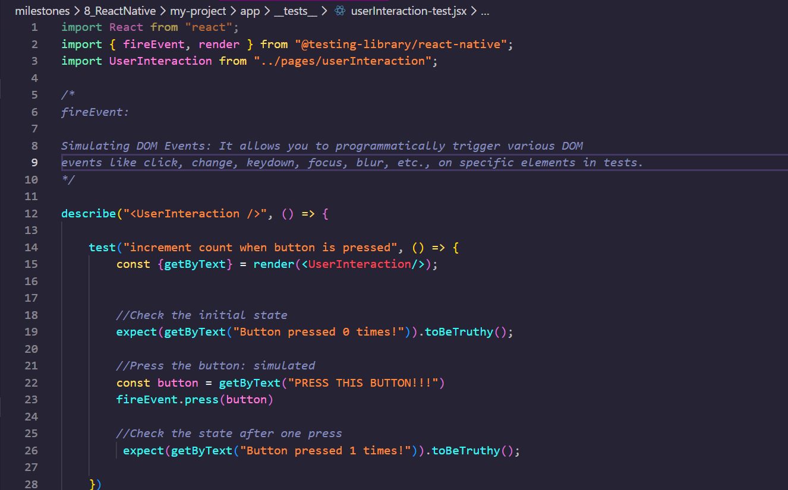
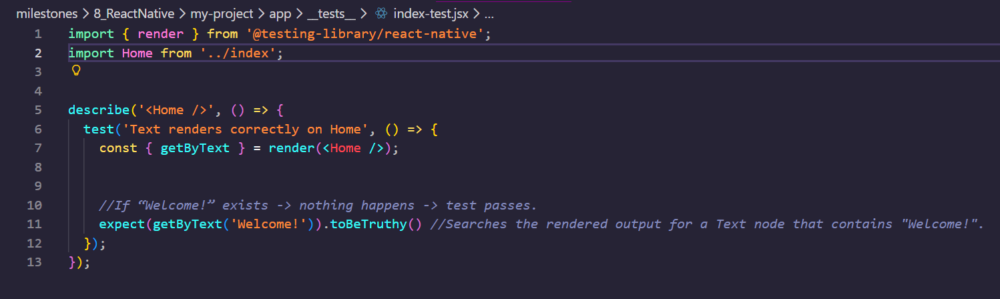
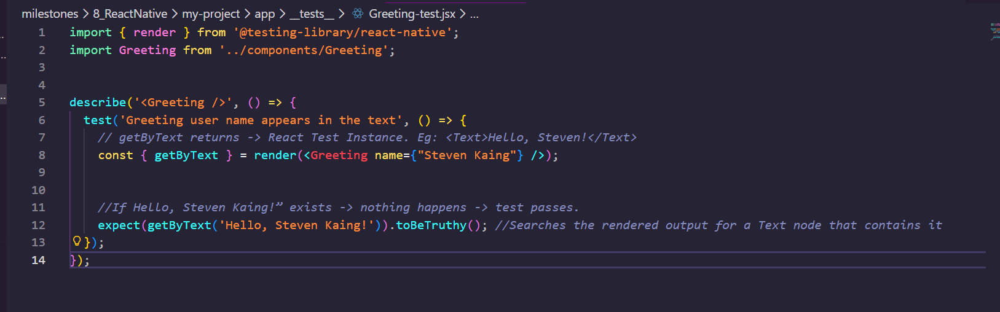
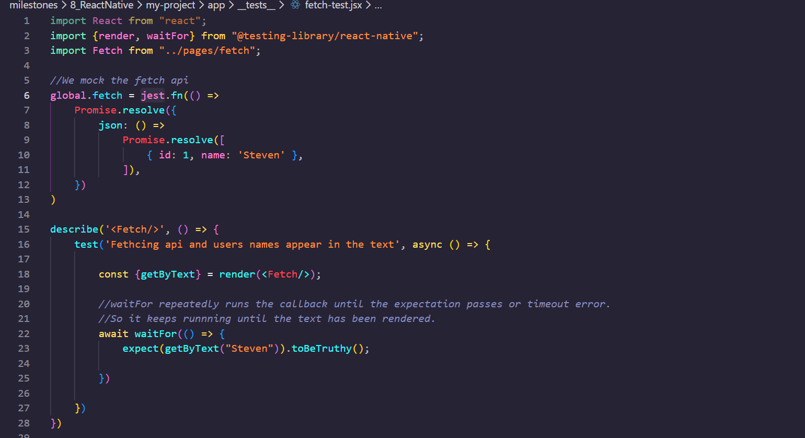
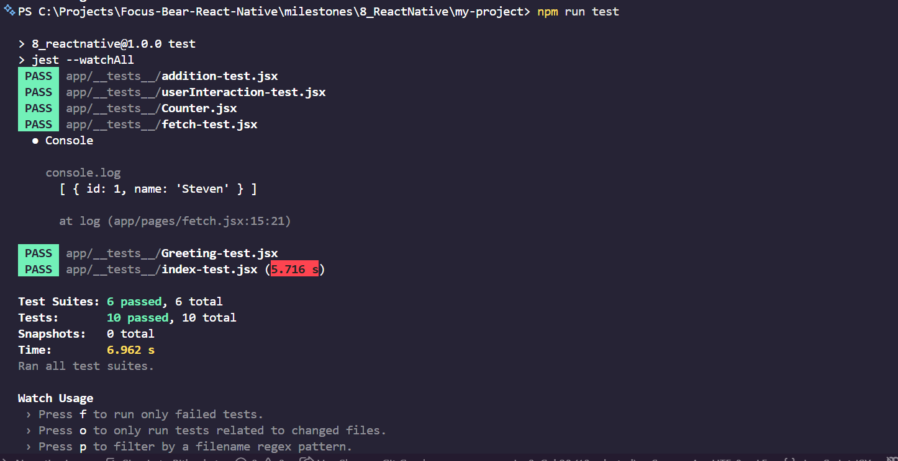

# Writing Unit and Integration Tests for React Native

[EXPO: JEST DOCS](https://docs.expo.dev/develop/unit-testing/)

## Software Quality Testing

### Unit Testing (DOES THIS SINGLE PIECE OF LOGIX WORK?)

- The purpose of unit testing is for developers to test individual components of the application, in isolation.
- The scope of this testing method: SMALL (ONE UNIT OF CODE)
- Tools: Jest

For example: We are testing if a button renders text when clicked on

### Integration Testing (DO COMPONENTS INTERACT WELL WITH EACH OTHER?)

- The purpose of integration testing is to test multiple components/modules working together
- The scope of this testing method: MEDIUM (based on interactions in your application)
- Tools: React Native testing library

For example: Testing if a screen correctly renders data from a mock API

### End-To-End Testing (DOES THE ENTIRE APP BEHAVE AS EXPECTED FROM A USER'S PERSPECTIVE?)

- Tests the entire application flow from the User's perspective.
- Scope: LARGE
- Tools: Detox, Appium

For example: Testing user login -> navigation -> data display

TLDR:

- Unit tests validate small, isolated pieces of logic.
- Integration tests ensure multiple parts of the app work together correctly.
- E2E tests simulate full user interactions on real devices.

## Why is testing important in React Native development?

In general, testing is important during software development, but is especially important in react native development:

- It ensures cross-platform consistency in all devices. Since React Native runs on multiple platforms, tests verify that components behave the same way on both iOS and Android.
- Improves refactoring sessions as we can refactor certain components knowing tests can catch the side effects of the changes
- Prevents project regressions

## How do you mock API calls in tests?

We can mock API calls in tests, using `jest.fn()`

```
global.fetch = jest.fn(() =>
  Promise.resolve({
    json: () => Promise.resolve([{ id: 1, name: 'Steven' }]),
  })
);
```

We are replacing the fetch() with a fake dummy that pretends to cal the API and instanty returns expected mock data.

## What’s the difference between unit and integration tests?

Unit tests involve one small piece of logic (function, hook, or component), whilst integration tests involve multiple components or modules and how tey interact with each other. So Unit tests are preferred if you want to test a single component in isolation whilst integration testing is preferred to ensure different parts of the app integrate correctly.

## React Native Testing Demonstration

Code snippets of tests:










Output:



In this case, I am testing the following React native features:

- Counter.jsx: checking if the counter renders completely and it starts with a value of 0
- Addition.jsx: computing sums with multiple edge cases correctly
- Checking if fetch api works and user's name appears coorectly
- Greeting.jsx displays name correctly
- User interaction when pressing a button and makes sure it works as expected (i.e. increments count when button is pressed)

I learnt that 