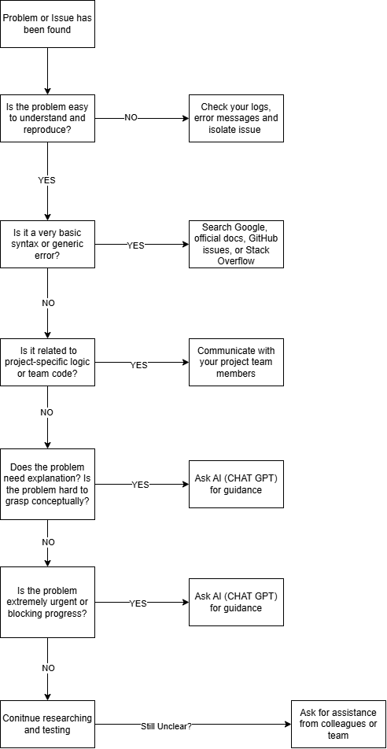

# When to Use Google, AI Tools, or Ask for Help?

## Best Practices for Troubleshooting Coding Problems

[How Senior Software Engineers solve coding problems](https://www.reddit.com/r/learnpython/comments/1ao82ku/whats_your_process_for_solving_coding_problems/)

The following process is what I strive to implement:

1. Everything begins with understanding the problem at hand first. If developers do not understand the issue, you will end up aimlessly looking for an answer that may or may not even exist. I attempt to reproduce the issue consistently and read any error messages carefully. Check any logs or outputs.

2. Once I develope a thorough understanding of the problem, the problem needs to be broken down into smaller components/sub problems. This includes doing any research on different parts, from software architecture to stack overflow posts. Its best to gain knowledge and as much useful information as you can, so you become more contextually aware of the problem. Additionally, in my mind, I would create intuitive test cases and what it needs to check off in order to be considered a solution. This is where AI Tools like ChatGPT come in handy as it is a great tool in explaining problems and providing any debugging hints.

3. Once I have a fairly analysed view of the problem, implement some psuedocode and implement it in code in earnest. At this stage, I am not worried about efficiency and code quality, simply wanting to solve the issue is the main priority here.

4. Once we have a solution, I will test it with my imaginary test cases and then I try more complex testing. This is usually in the form of integration testing and unit testing and making sure the problem is solved when all components involved are working as expected.

5. Refactor the solution to adhere to any code standards and write any appropriate amount of automated tests for it. Also provide any documentation for future developers.

## Simple outline of decision making tree: using AI

## When do you prefer using AI vs. searching Google?

I prefer to use AI when I need quick conceptual explanations. A task that GPT does extremely well compared to the other ai tools is that it explains foregin concepts in a simple manner. It allows for me to understand the problem easily and solve the problem.

I would use google if the problem is related to anything hidden inside the official documentation or error messages that have specific references and can be found in Stack overflow (i.e. any posts where other developers like me have also encountered the error). For more authentic responses, any advice I need (i.e. structuring code, tips from senior level engineers), I would always choose to search it on google via reddit posts or stack overflow.

## How do you decide when to ask a colleague instead?

I ask a colleague when the issue involves project-specific logic or shared code dependencies. I also ask for help if the problem is blocking progress or I’ve already spent a reasonable amount of time researching without any major progress.

Also, if I want another perspective on how to appraoch the problem, then I would often reach out to my peers.

## What challenges do developers face when troubleshooting alone?

An issue that annoys me as a developer is when I finally found a solution online but the solution is OUTDATED and there still hasnt been an answer for it over the years. Since you have no colleagues to ask, it becomes a blind journey trying to find the solutions to these issues.

In general, troubleshooting alone can also lead to wasted time chasing something that doesnt solve the issue. Collaboration and guidance from others can provide faster, more accurate solutions.

Another issue is researching and absorbing too much information (information overload). Developers would tend to drift off and lose focus of the main problem at hand.
