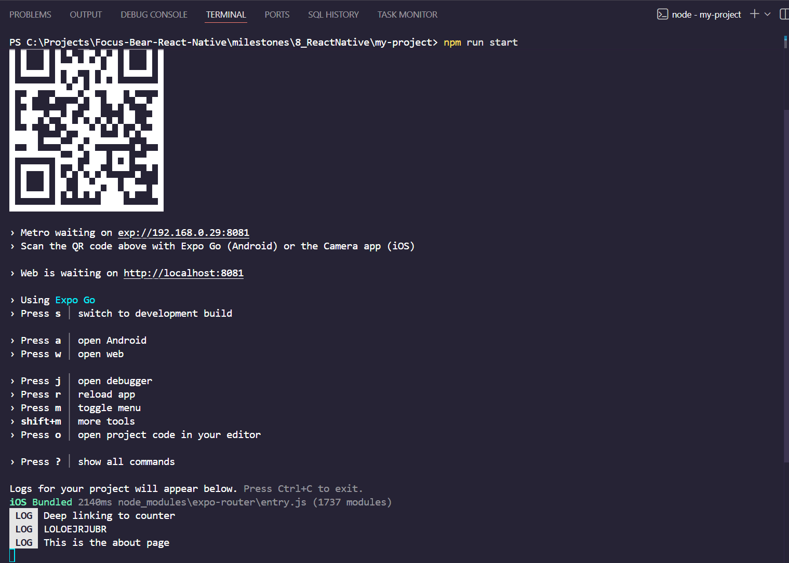
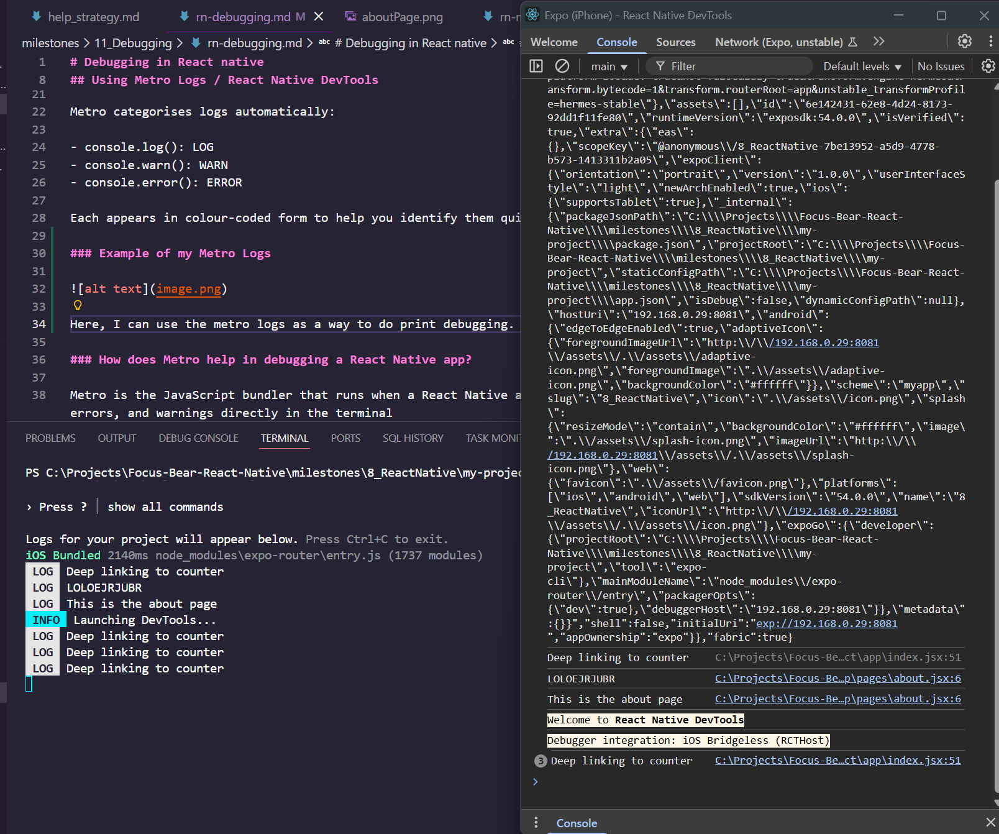
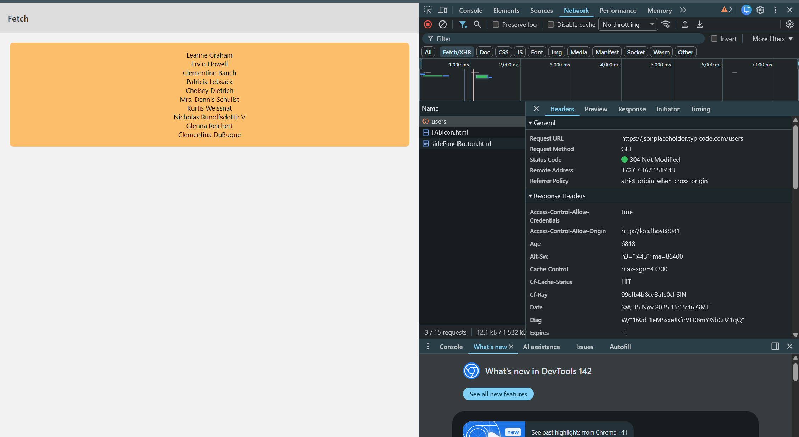

# Debugging in React native

[Debugging in React Native](https://www.youtube.com/watch?v=FXn1vUGCci8)

>NOTE: Clear Metro cache if logs or code don’t update:
>npx react-native start -c or npm run start -c

## Using Metro Logs / React Native DevTools

Metro is the js bundler that runs when we start the React native app and compiles our code. It also displays any console.log messages across components from the application. This is known as Metro Logging (basically print debugging).

Instead of using the terminal, we can open the React Native debugging tool and view the messages there.

Expo allows us to also see logs in the Metro web dashboard:

```
http://localhost:8081
```

Inspect element and click on console like a normal web react application

Metro categorises logs automatically:

- console.log(): LOG
- console.warn(): WARN
- console.error(): ERROR

Each appears in colour-coded form to help you identify them quickly.

### Example of my Metro Logs



Here, I can use the metro logs as a way to do print debugging.

### Example of using React Native Debugger Tool



We can also view the print logs in the React native dev tool

### Example of inspecting network requests in react native



In React Dev Tools, you can press the network tab and view the network requests. In this example, in the `fetch` page, I am fetching the users data in a api placeholder.

>NOTE: React Devtools was made to be very similar to the web dev tools, looks exactly the same thing

### Challenges when setting using the Dev Tool

I had an issue where the in the networks tab, the api requests werent showing. I tried looking at multiple stack overflow threads from 10 years ago that might resolve my issue. For example, most of the solutions invovled enabling network requests in your simulator. But the issue was that I was using Expo go on my phone.

Well, I later found out this was simply because my internet connection at the time was not stable at all and was slow. Mobile data did not work as well. I confirmed this as I navigated to the `fetch` page, the app could no longer fetch the data and even timed out due to poor connection.

### How does Metro help in debugging a React Native app?

Metro is the JavaScript bundler that runs when a React Native app starts. It helps with debugging by displaying real-time logs, errors, and warnings directly in the terminal

Us developers can insert `console.log`, `console.warn` and `console.error` statements to track the values of variables, feedback, app states and run time errors. Metro also provides very quick shortcuts to gain access to these tools (i.e. press r to reload, press j for dev tools) and helps identify issues quickly.

## Reactotron

[How to integrate Reactotron](https://www.youtube.com/watch?v=FnKGRha-k-o)

[Reactotron Github](https://github.com/infinitered/reactotron)

## Flipper (DEPRECATED IN FAVOUR OF REACT NATIVE DEV TOOLS)

### What debugging features does Flipper provide?

Flipper essentially acts as an all-in-one debugging dashboard for Android and iOS. It has a neat desktop application as well (So far i could not install it on windows)

- Network request inspection. It allows developers to analyse api requests and responses
- console logs and errors
- Inspect elements and layouts
- Inspect components, trees and states
- Integrates Redux & AsyncStorage plugins

## How can you inspect network requests in React Native?

React Native Debugger as it integrates with Chrome DevTools to monitor fetch and Axios calls (i.e. Inspect fetch() and Axios calls under the “Network” tab) You could also wrap the network calls with console.log (metro logging) and manually print to the terminal the requests URLS o responses for quick checks.
