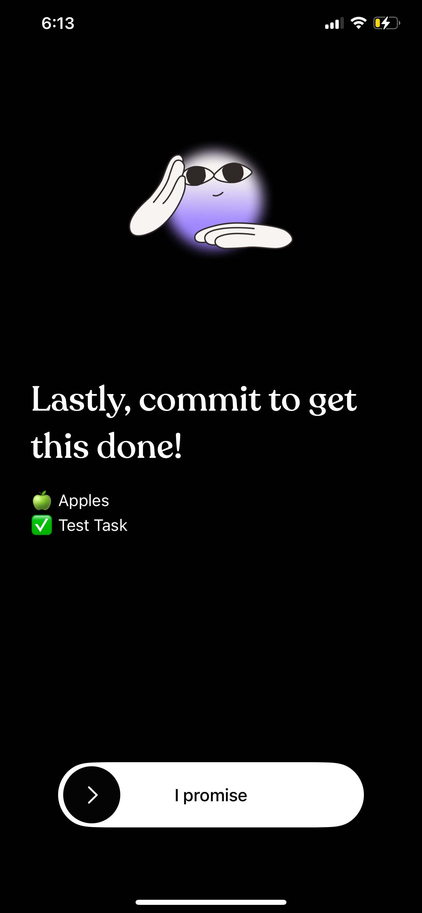

### What makes Focus Bear different from these apps?

Focus Bear emphasises a Neurodivergent design philosophy. Freedom and Cold Turkey are general productivity tools. On the otherhand, Focus Bear is mainly designed for audiences with ADHD and autism.

Focus Bear provides more of a comprehensive support/content. The listed competitors typically focus on one to two main areas. For example, Tiimo mainly offers plannning features and Freedom/Cold Turkey mainly offers blocking/locked mode features.

I noticed that Cold Turkey is blocked by a paywall ($59.00) compared to Focus Bear's more affordable and flexible plans, including a free tier or a $4.99/mmonth with a 7 day free trial. This gives Focus Bear a huge advantage in terms of cost efficiency.

In terms of the landing page, compared to the listed alternatives, there are interactive tools lie sliders that make the user engaged. This definitely separates Focus Bear from the "standard" pages you normally see, having a more impactful experience for the user. Additionally, there are Online Assessment Tools that educate or with ADHD/Autism testing which can give good indications to the user.

### If you were a user, why would you choose Focus Bear over competitors?

If I was a user, I would definitely select Focus Bear over the competitors if:

- I've been diagnosed with ADHD and autism and need to increase my day-to-day productivity
- I want a overall, well rounded comprehensive support in one app. Rather than juggling multiple apps (a blocker + a habit tracker + a routine planner), Focus Bear provides everything in one place, reducing cognitive load.
- I want to utilise my tool across multiple types of devices/OS.The seamless cross-device experience means my focus session continues whether I'm on my laptop or phone.

### What’s one feature that other apps have that Focus Bear doesn’t?

A key feature that I've noticed in Tiimo is its visual planning feature. This makes sense as Tiimo mainly focuses on having enhanced planning to increase productivity. Tiimo introduced an AI empowered task breakdown, allowing for effortless planning with AI. This turns the users ideas into small structured tasks allowing it to be digested easily. The use of AI here is definitely a main advantage in using Tiimo over Focus Bear as Focus Bear doesnt seem to have any built in AI features.

When I downloaded and tested the free tier of Tiimo, the introduction to it definitely felt more inviting and intuitive. I liked the interative views in the introduction to the app and how it let me start my journey. It felt like a warm welcoming to the app.

So something Focus Bear is include more engagement in the beginning where users sign up. Messages like "Congrats,...." or something to motivate the user to continue to sign up, definitely creates a first good impression of the app.

### Based on your research, what’s one improvement you think Focus Bear could make?

Introducing AI-powered task breakdown.

I think that certain tasks can be quite overwhelming and complicated to complete during their day for ADHD users. Thus, I would like to see an AI agent to act as an assistant or co-planner into transforming the user's ideas into structured tasks, breaking them into simpler steps and reducing the total cognitive load on the user. Additionally, maybe include estimated time durations.

This improvement shouldnt really be limited to just task breakdown. Maybe the use of AI can be integrated in other features.
