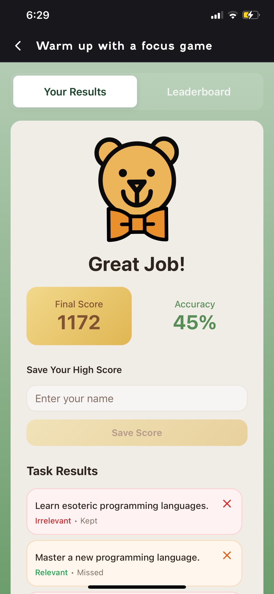
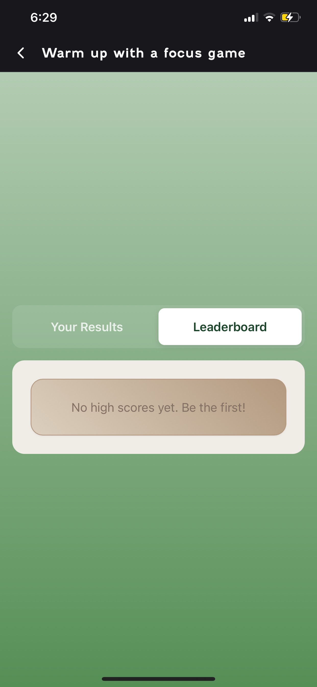
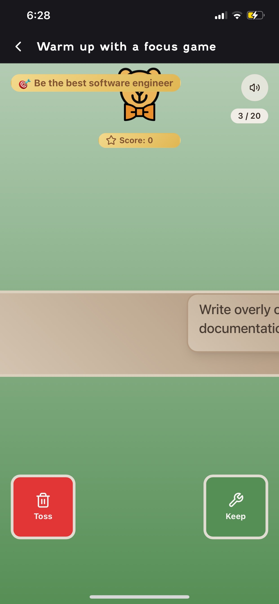
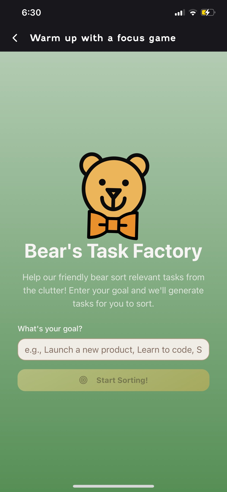
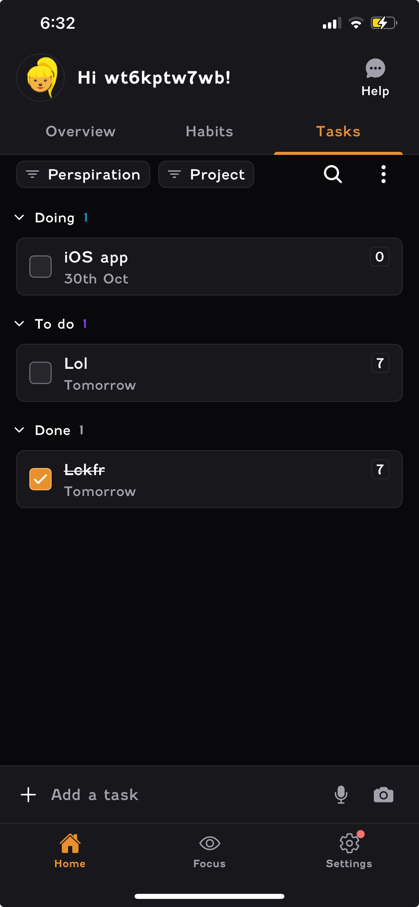

# Try out the Focus Bear app

Love the idea of an interactive game feature where the user gets to try out a game. Upon playing the game, there were definitely a few improvements that could have been made. For example:

The overall layout and structure of the results view controller could definitely need some refactoring to make it more consistent. Comparing the first and second image above, the segmented controls positioning definitely seems inconsistent and off.

Suggestion: Make both segmented control bars at the top as it feels more intuitive for the user.

Some of the UI components feels cluttered. For example, the overall goal at the top is covering the Focus Bear logo.

Love the feature of giving the user an option to mute the sound or turn it on, for more flexibility.

Suggestion: Make the prompt or goal the user entered previously in the center of the view as it is clear to me what I should be doing when swiping right and left.

Suggestion: placeholder text should be wrapped so it doesnt look cut off.

For some reason, maybe its just me, but it is really hard for me to see the coloured "number" next to the "TODO", "DOING", "DONE" sections, especially hard to see in dark mode. Also, sometimes its hard to know that the TODO, DOING AND DONE are colour coded

Suggestion: Like Tiimo, I would say make the "TODO", "DOING" and "DONE" more liek coloured Pills instead as it is more readable for the user.
