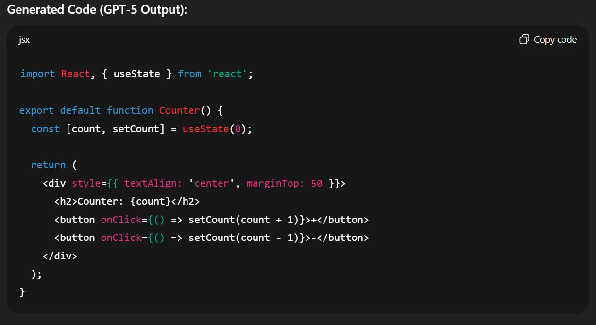
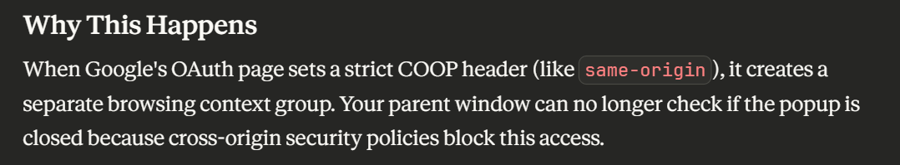
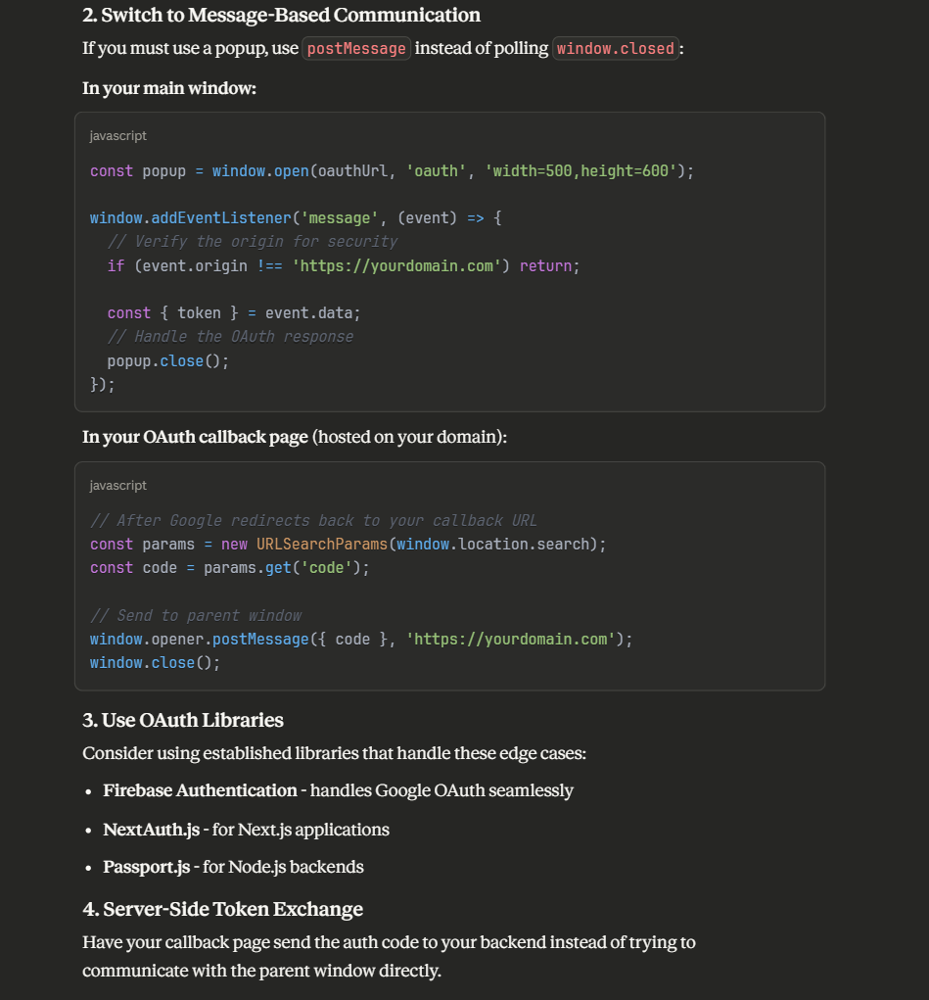

# Using AI Tools

I believe that AI tools should be integrated into your development cycle and workflow to increase speed and efficiency.

### Tools used

- ChatGPT
- Claude AI

### What worked well and What didnt work well

- ChatGPT: When using GPT, I try to ask GPT to write me specs and standard code requirements like a CONTRIBUTION.md or README.md file. I think that GPT excels in developing a detailed outline from a set of given specs/instructions. We can also generate a detailed and comprehensive prompt that can be used for Claude AI code generating. I found GPT to explain concepts more clearly and detailed compared to Claude AI, hence, to learn and imporve on your skills, I recommend using GPT to help with that. In terms of code quality, Claude definitely exceeeds GPT as GPT would produce "lower" quality code segments in most scenarios.

- ClaudeAI: Once you have the specs from GPT 5.0, we upload them to Claude AI. Claude AI excels in generating contextually rich and emotionally aware responses. Additionally, claude AI would be more useful when working on projects that required a deep understadning of user interactions or creating new features/content. However, I found that Claude AI would "over complicate" or "over engineer" certain feautres and make it overcomplicated. However, this can be reduced by improving on context/prompt engineering and asking claude to be more specific so it doesnt go overboard. Also, I think the message limit of Claude AI is a major disadvantage, which makes long debugging sessions cumbersome adn tiresome.

So, I believe that the most optimal workflow is to leverage the best of both worlds. We should use both tools to cross verify outputs. However, I will mainly use Claude Ai for coding tasks/debugging and gpt for general purposes.

### When to use AI for Coding?

- Quickly generating boilerplate or repetitive code
- Explaining new programming concepts when learning
- Assisting with debugging when clear error context is given
- Provide and draft a demonstration of how a feature should look like

### AI Implementation Example

## Code Generation (gpt)

> PROMPT: Write a simple React counter component with increment and decrement buttons using functional components and hooks.

Generated Output

I ran this in my React test project (npm run dev) and it worked correctly. GPT’s version was concise and functional. I later asked Claude to refactor it with TypeScript types and better styling, which improved maintainability.

## Debugging Session (claude ai)

Context: I encountered a React error

> "Cross-Origin-Opener-Policy policy would block the window.closed call error while using google auth"
> PROMPT: "I'm getting an error where Cross-Origin-Opener-Policy would block the window.closed call when using google OAuth. What's wrong? "

Claude AI explains why the error occurs in the first place:

Then, Claude AI begins to explain the possibe solutions to the issue:

Implementing the above solution removed the error completely and no other warnings popped up.

## Learning a new concept

Concept: Redux Toolkit Slices (milestone 7)

>PROMPT: "Explain how Redux Toolkit slices work and why they’re better than traditional Redux reducers."

GPT explained that slices combine actions and reducers into a single structure, reducing boilerplate and improving code organization. It provided an example using createSlice and showed how it automatically generates action creators. I used this to refactor one of my existing Redux files, resulting in cleaner and more maintainable state management.
