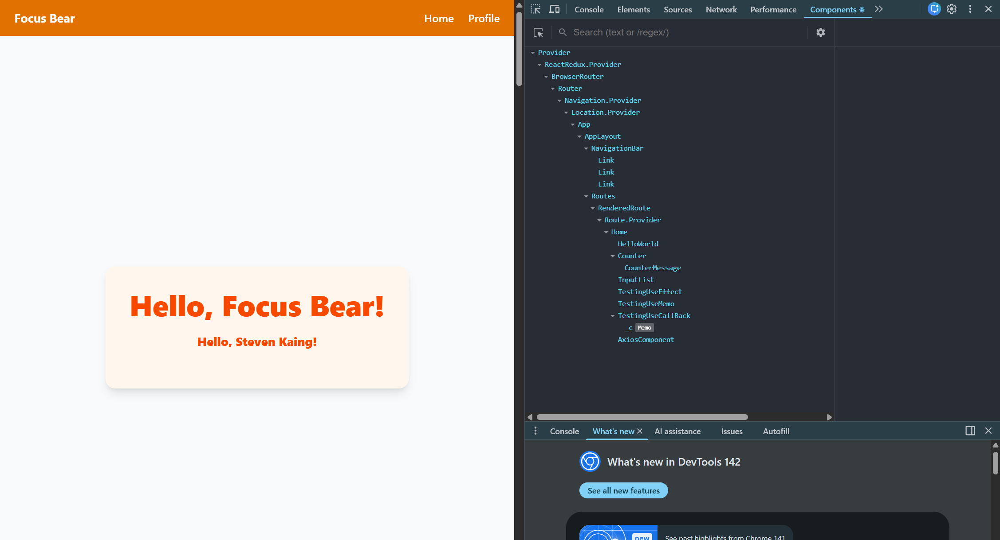

### Which Extensions did I install and Why?

From the list of extensions, I chose to install the following that suited my workflow:

- React Developer Tools
- Lighthouse
- Redux Devtools
- JSON Viewer

These were installed as Chrome Extensions on Chrome browser.

1.React Developer Tools
I have already used React Developer Tools and definitely has assisted me in my react development. I mainly use the "Components" Tab and gives the user a component diagram or hierarchy tree of our current application. When you hover each component, you can inspect the props, source file, rendered by and the target DOM or root element the component represents. If you are using useState/setStates, then you can view the states/values of certain variables.

This the react project hierarchy tree.

Additionally, another underrated feature is that you have the ability to render the component to the console, where u can view the details of current states/hooks.

You can also inspect a component’s state/props in the right panel. For example, we can inspect the Counter

2.Redux Developer Tools

I have not used this tool and is my first time implementing this in my workflow. I decided to install this extension as i am currently not using any external bugging tools. Since a lot of the times I've been using print debugging, I think its actually more efficient to use Redux Dev tools to assist in subsequent development/actions. For example, if you were to increase the counter via a button click, you can view the state of the application and its variable values BEFORE the button was clicked and AFTER the button was clicked, which helps in trying to identify bugs.

Additionally, if u wanted to dispatch an actiom but there is no UI element for it, you can simply type the action and execute it as if there was a button to be clicked on.

Also, to get it fully functional, you need to integrate it into your aapplication like a store.js
<https://github.com/zalmoxisus/redux-devtools-extension>

When clicking an increment button in my React counter app, the DevTools show the dispatched action (counter/increment) and how the state changed and a useful thing is that i can view the state of variables after each eaction has occurred.

You can also playback the states of the variables and watch it live.

3.Lighthouse
In order to improve on your application, you can use tools such as Lighthouse to give you an analysed report of your URL application and give you suggestions on how to improve on it whcih can be useful. Essential metrics provided are based off Google's core web vitals.

Very simple to use and gives you an overall report of how your application runs on the browser.

I used it to run audits on my React app and received a full report with scores for performance, sccessibility, best Practices and SEO.

From this, we can see that our app has a bunch of unused javascript code that can be removed to reduce the bundle size.

Passed Audits

4. JSON Viewer
JSON Viewer transforms raw JSON into a well-organized, color-coded tree format with indent guides, which is much easier t oread than a single block of text and its very useful for developers who ienteract with jsons on a regular basis.

I installed JSON Viewer Pro to format and inspect JSON API responses directly in the browser.
I chose this one because it supports collapsible tree views and syntax highlighting, making it much easier to understand nested data.

I tested it using the mock json api site: `https://jsonplaceholder.typicode.com/comments` from the github docs

Here, the json is automatically formatted and indented in a way that allows developers to easily read JSON files.