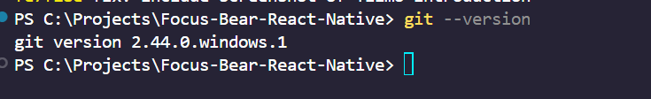

### Have you used Git before? If so, in what context?

I have used GIT in many occasions during uni and personal projects. I typically use GIT to manage git branches, commits my changes, merge and collaborate with other developers on our team github repository.

### Which Git client (if any) did you choose? Why?

I mainly use GIT in VSCODE as it is intuitive and easier to use in my workflow and development. Most of my development occurs in VSCODE. However, from time to time, I use GITHUB DESKTOP but very rarely.

### What was the most interesting thing you learned about Git today?

Recently came across a new git command:

git rerere: Stands for "reuse recorded resolution"

[How does git rerere work?](https://www.youtube.com/watch?v=syY_fBlaKyU)

<https://stackoverflow.com/questions/49500943/what-is-git-rerere-and-how-does-it-work>

```
//enabling git rerere

git config rerere.enabled true 
```

> NOTE: RERERE DATA IS STORED LOCALLY AND NOT PUSHED REMOTELY

1. When a merge conflict occurs, git rerere records the state of the conflicted file before any resolution
2. After you manually resolve the conflict and stage thefile, GIT RERERE records your resolution. This post-image is stored alongside the pre-image, creating a resolution pattern.
3. When the same conflict pattern appears again, git rerere recognizes it and automatically applied your previous resolution. You see a message like "Resolve... using previous resolution".
4. Then, you review the changes and commit your self as it does not automatically commit

- this feature helps Git remember how you resolved a conflict and automatically reapply that resolution if the same conflict arises again in the future.

### Personal hands on experience

I have successfully installed git and below is my version of GIT:



The version of git as of October 2025 is `version 2.44.0.windows.1`.

Example of commit and push from my terminal:


Example where GIT helped me the most in a project team environment:

Last week, in my project team (we were creating an desktop board game called Santorini), two members edited the same component file on different branches. Luckilu, the git allows us to resolve merge conflicts easily and using Git, I resolved the conflict manually once.

However looking back, i realised that i resolved similar merge conflicts like that over and over again and could have used `git rerere` and automatically apply my previous resolution, saving time and preventing potential errors.
