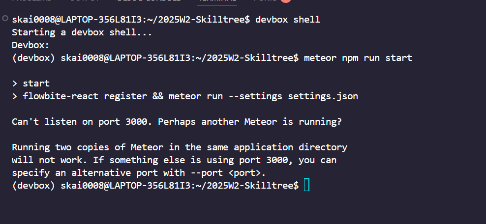
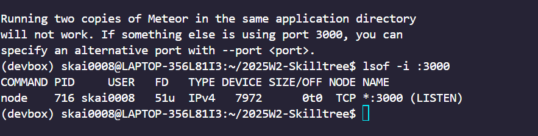
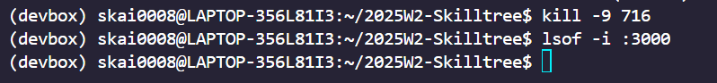
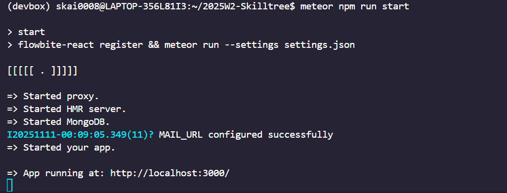

### Which terminal client did you choose? Why?

Windows Terminal + Powershell

- Throughout my journey, I have mostly worked on a Windows Environment and am somewhat experienced with the overall navigation and common commands used.
- I use the default settings without any custom themes or plugins, which keeps the setup lightweight and simple.
- Occasionally, I also use Windows Subsystem for Linux (WSL) when I need Linux-specific commands like `kill -9` or `ls`

### What customisations (if any) did you make?

- None at the moment. I stick to the default PowerShell profile for simplicity.

### What was the most useful command you learned today?

- The most useful command that I have used is `kill -9 PID`

There are many times I've had running ports in the background that prevented me from running on localhost:3000.

In Windows PowerShell, instead of kill -9 PID, I also use:

```
Get-Process -Id <PID> | Stop-Process
```

Or, if I want to find processes using a specific port:

```
netstat -ano | findstr :3000
Get-Process -Id <PID> | Stop-Process
```

This has saved me many times when React development servers were stuck and localhost:3000 was already in use.

### Example of using `kill -9 PID`



> Another process was running on the port 3000



> Find and list all the processes connected to :3000 port



>Then, kill the process using PID



> Process running on port 3000 successfully

A personal example: I was working on a react project in WSL (note: was working on WSL as we were using devbox to speed up the environment, so essentially its like docker), I ran into an issue where npm start would fail because port 3000 was already in use by another process from a previous session. Using the PowerShell commands above, I quickly found the process ID and stopped it, allowing me to restart the development server without rebooting my machine. This saved me time and avoided frustration during a tight development session.

Another one is echo helloworld...

```
echo "helloworld"
```

Mostly just to test out scripts and see if they are working or not!
