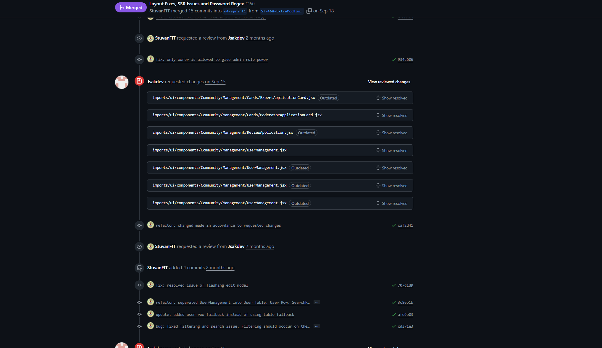
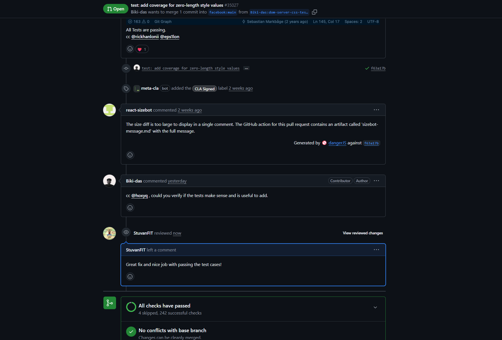
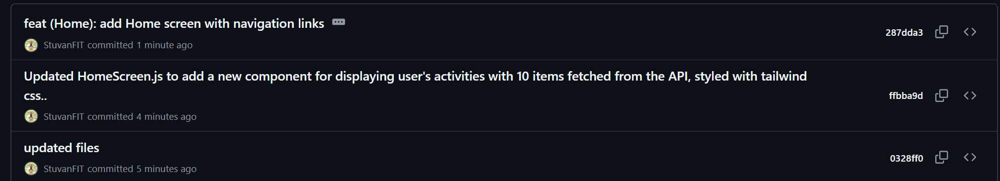
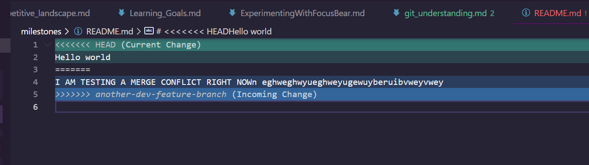
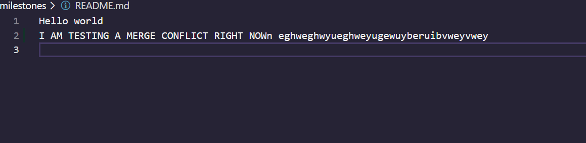
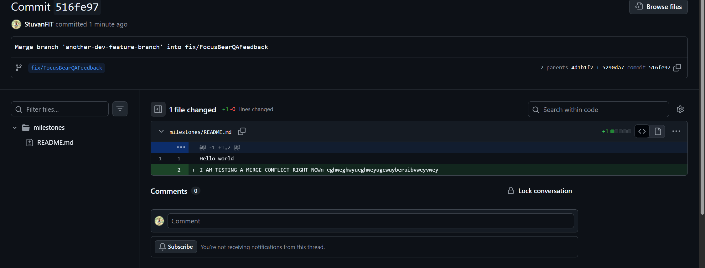
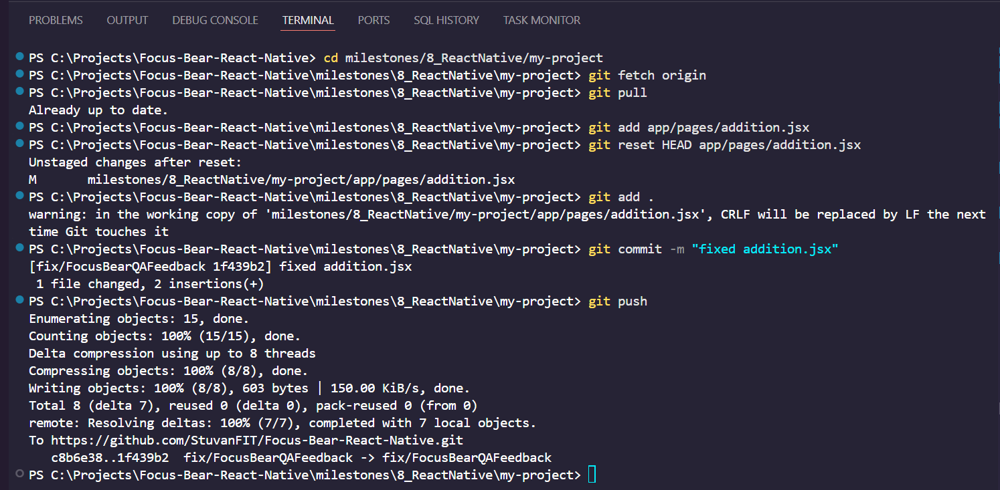

---

# Pull Requests

<https://docs.github.com/en/pull-requests/collaborating-with-pull-requests/proposing-changes-to-your-work-with-pull-requests/about-pull-requests>

Example of me initiating a Pull Request with a reviewer/peer:
<https://github.com/Monash-FIT3170/2025W2-Skilltree/pull/150>


This is me initiating the PR



Fixed any issues my peers have brought up

### What are Pull Requests (PR)?

A Git Pull Request (PR) is a proposal to merge set of changes from one branch into another branch. In these Pull Requests, collaborators can review and discuss the proposed changes before they are fully integrated into the destination branch.  

### Why are PRs important in a team workflow?

PRs are very important in a team workflow because they allow developers to perform collaborative reviews of proposed changes, which improves code qualityby identifying potential bugs, issues or spots of refactoring before merging into the destination branch (usually a dev branch or main). They also provide traceability and documentation by creating a historical record of changes and discussions, foster knowledge sharing among team members, and allow for automated checks like testing to ensure stability. Ultimately, pull requests streamline collaboration, enhance code quality, and promote more efficient and reliable software

### What makes a well-structured PR?

Having a Pull Request template. This allows for Pull Requests to be standardised and prevents PRs from being rushed or provide little information (i.e. no summary of changes, no topics). A pull request would typically have:

- Short summary of changes
- Related Issues
- Screenshots if applicable
- A link to the related ticket in the work backlog (if applicable)
- a reference to any tech debt incurred as a result of the change
- Checklist for code quaity (i.e. Have I included comments in complex sections?)

### What did you learn from reviewing an open-source PR?



Almost every good PR ive seen contain comments and active/productive discussions on how to improve on the code or potential issues in the PR. Even if the change is really small, it would include comments on what to improve on in the future or dependencies.

Additionally, I've also learnt the value of PRs and how they are essential in a software developers workflow and simply merging changes straight away without thoroughly reviewcing code changes can degrade the code quality.

---

# Commit Messages

### What makes a Good Commit Message?

There is no one right way of writing a good commit message. Every company or team will have their own style or preferred format.

So the only measurement of a good commit message is that the commit message should clearly explain the changes made accurately and succinctly under a limited number of characters. Commit messages are meant to be read by human developers, thus it should be readable and understandable to any developer.

However, a team should implement a standardised commit message format the every team member should follow to ensure consistency!

My personal style is to prefix with a one/two word summary if what "category" or "area" of the project was touched on, followed by a short description of the changes made (under 60 characters).

<https://www.conventionalcommits.org/en/v1.0.0/#summary>

For example: feat: allow system to send email to customer when email is sent

### How does a clear commit message help in team collaboration?

1. A well-written commit message provided immediate context or changes, usually explaining what was changed/added/updated and why it was changed. This allows team members to quickly grasp the purpose and impact of the commit without needing to meticulously review the code itself, saving time and reducing cognitive load.

2. Easier git history tracking. If the team identifies a bug, it is easier to locate the bug or where the crash occurred when commit messages are more detailed. For example (feat: added stop watch timer for Focus Bear ---> and the stop timer has a bug, then we know that this commit introduced the bug)

3. Commit messages serve as a living documentation of the project's history, capturing decisions and rationale that might otherwise be lost. This shared knowledge benefits the entire team and contributes to a more robust and maintainable codebase.

### How can poor commit messages cause issues later?

1. When commit messages are not clear or do not provied enough context for developers, this makes it almost impossible to know why the change was made. The “why” behind a change is often as important as the “what.” So if developers in the future look at the commit history, they will have no clue of why changed were committed.

2. If you need to roll back a specific change, unclear messages make it much harder to find the right commit to revert.

### Examples of different commit messages



Vague Commit Message:

```
"updated files"
```

Overly detailed Message:

```
"Updated HomeScreen.js to add a new component for displaying user's activities with 10 items fetched from the API, styled with tailwind css.."

```

A Well-structured Message:

```
feat (Home):  add Home screen with navigation links

- Implemented home screen card that styles the home page
- Include navigational links using <Link/> to other pages

```

Some commit messages include optional FOOTERS such as:

- BREAKING CHANGE
- Closes #ISSUE_REF
- Fixsed #ISSUE_REF
- Co-authored-by: Steven Kaing <steven@example.com>

So TLDR:

- HEADER: "What?"
- BODY: "Why/How?"
- FOOTER: "References or extra notes that dont belong in the description but are important for tracking purposed"

---

# Important Git Commands

```
git fetch origin
git checkout <branch (remote or local)> -- <file>

For example: git checkout main -- <file>
```

**WHAT IT DOES**: This command restores a specific file from the main branch into your current branch. Does not have to be main branch it can be any git branch locally or remote.
**WHEN TO USE**: If you’ve messed up a file locally and just want the version from the target branch, without touching your other changes.

```
git cherry-pick <commit>

git cherry-pick abcdefg
```

**WHAT IT DOES**: Applies a specific commit from another branch into your current branch, without merging the whole branch.
**WHEN TO USE**: If there’s a useful fix or feature in another branch that you want to pull in without merging all the other work from that branch. So, u are cherry picking which commites you want to merge without merging all the other commits. very useful for isolation testing with certain commits/bug fixing.

```
git log

More cleaner and less spaced out git log:

git log --oneline --graph --decorate

```

**WHAT IT DOES**: Shows the commit history the current repository
**WHEN TO USE**: To review what’s been committed, who committed it, and when. Great for understanding project evolution and how it has changed.

```
git blame <file>
```

**WHAT IT DOES**: Shows which commit and which author last modified each line of a file.
**WHEN TO USE**: To track down when/why a specific line of code was introduced or changed, and by whom

### What surprised you while testing these commands?

Underestimated the value of `cherry-pick`. Usually, if I wanted to test a feature that had changes (involving more than one feature) made by another developer in another branch, the common action I would do is just to pull the branch into my current dev branch. However, it would be cleaner to just merge the single commit that involved my working feature.

Initially, I though it was inherently bad practice to user `cherry-pick` as there is a risk of duplicate commits (the same change now exists with different commit hashes on multiple branches) and overusing `cherry-pick` definitely makes the git history hard to follow.

So, I reckon i will only use `cherry-pick` in very very specific scenraios like hotfixes, backports, isolated commits. Usually a merge or rebase would be better in most cases.

---

# Understanding `git bisect`

### What does `git bisect` do here?

`git bisect` is a binary search tool for your repo git history to efficiently identify the specific commit in a project's history that introduced a bug, regression, or any other change in behavior.

```
git bisect start

#Set up endpoints
git bisect bad  <hash commit>                       #You know that this commit is not working
git bisect good <hash commit>                       #You know that this commit is working
git bisect bad/good                                 #the current commit in the binary search is bad/good

#Then, biset does a binary search algorithm. So we should be on the middle commit. Test the state of that commit by runnign the application. If the current commit state is not working, do `git bisect bad` or if working, do `git bisect good`

#We do this until we land onthe commit that introduced the bug.

git bisect reset
```

### When would you use it in a real-world debugging situation?

- If there are a lot of files and commits, it will be tiresome to scan through all of them to find the bug.

An example of where it is useful:

- App was building fine on Oct 1.
- By Oct 6, App builds crash.
- Use git bisect to quickly find which commit between those dates introduced the build error.

```
git bisect start
git bisect bad HEAD         # current commit is broken
git bisect good <old-hash>  # last known working commit
```

### How does it compare to manually reviewing commits?

For manual reviewing:

- You look at relevant files that are associated with the bug and try to manually scan where in those files caused the bug.
- It is very time-consuming, error-prone if there are many commits.

For `git bisect`:

- It is a more efficient search, using binary search algorithm reduces effort from N commits to about log2(N) tests. SO if you have 128 commits, you only need to review about 7 commits.

---

# Merge Conflicts

### What caused the conflict?

The conflict happened because two different branches modified the same section of the file. When I tried to merge them, Git couldn’t automatically decide which version of the changes should be kept. So, both branches had edits to the same lines, so Git flagged it as a merge conflict.

### How did you resolve it?

- Opened the file and looked at the conflict markers (<<<<<<<, =======, >>>>>>>).
- I compared the changes from both branches, decided which parts to keep, and in some cases combined the edits manually.
- I removed the conflict markers, saved the file, staged git add, and completed the merge with git commit.

### What did you learn?

- Resolving merge conflics requires great attention to detail and the importance of clear commit messages which make it easier to understand what each branch is doing when conflicts arise.

Below is an example of a simple merge conflict:

- Branches involved: `fixFocusBearQAFeedback` and `another-dev-feature-branch`

In one feature branch, developer A edited a file called README.md and psuhed the changes to the remote repo

```
I AM TESTING A FEATURE BRACH
```

Lets say developer B that is working on the same file but on a different branch, edits the same README.md file on the same exact line and pushes his/her changes into the remote repo

```
Hello World
```

Then, developer B wants to merge developers A feature branch into feature branch B. THere will be a merge conflict:



To fix, this you need to decide whether to keep your CURRENT CHANGES, ACCEPT THE INCOMING CHANGES FROM FEATURE BRANCH B or accept BOTH CHANGES.

In this case, I want to accept both changes.



I found it interesting how Git marks conflicts with clear delimiters (<<<<<<<, =======, >>>>>>>). Initially, it was confusing which section belonged to which branch, but using the GitHub Desktop conflict resolver made it much clearer. This helped me understand how Git tracks and merges changes line-by-line.

I also used the following command to view the entire git history and where the merge conflict occurred.

```
git log --oneline
```

commit hash: 516fe97 is where the merge resolution occurred



---

# Staging VS Committing

### What is the difference between staging and committing?

**Staging:**
Imagine you are a customer doing online shopping at Coles. Your browse through all the products and pages and add some of those on-sale products to your shopping cart. In this case, you are staging your changes in a shopping cart. Products are there ready to be paid for when you go to checkout but you can keep adding stuff to it or remove some from it.

**Comitting:**
When you head to checkout and go to pay for the products in the shopping cart, this is basically "committing" your changes. There is now a record (receipt) somewhere of what you have bought from Coles.

Note: you can easily remove/add products to the staging (shopping cart) but it is harder to add/remove items after the staging area (already paid for).

### Why does Git separate these two steps?

There are many benefits in having 2 steps.

If makes your commits clearer and concise. You may have multiple changes to multiple files. These changes could be related or unrelated to each other. Thus, you can choose which files to add to the staging area and make sure that all changes related to each other are in one commit. So, you may have multiple changes in your working directory, but not all are ready to be committed and staging lets you pick and choose.

### Example of staging vs commiting



### When would you want to stage changes without committing?

I would stage changes without committing when:

1. I have partially finished a feature and want to save some changes for the next commit, but not all changes
2. Use as a checkpoint. As I work on the project, I will stage as I go but only commit to the repo when I have finalised these changes.
3. I have edited multiple things in one file, but only some belong to the current commit.

---

# Branching & Team Collaboration

### Why is pushing directly to main problematic?

Directly pushing into main is forbidden in many project team environments.

1. Risk of breaking feautures: If your main branch is where production code is placed, then pushing direclty into main increases the likelihood of changes breaking.
2. No organisation. It results unclear changes as they are not organised into feature and development branches
3. Harder collaboration. Peers will have a more difficult time in understanding a bundle of commits
4. Reduces likelihood of conflicts and overwriting files

### How do branches help with reviewing code?

In project teams, developers should work on a feautre in a separate branch without touching the main branch.
In each feautre branch, we can run tests, CI pipelines, or QA reviews without affecting the stable branch. Thus, this makes it clearer which commits belong to which feature or fix.

Additionally, you can open a PR to let other peers review your changes before deciding to merge into the main branch.

### What happens if two people edit the same file on different branches?

If multiple developers work on thesame file but on different branches, we know that the changes are made safely on their respective branches, not affecting main branch. If the developers decide to merge their changes with each other (i.e. both edited the same file), a merge conflict would definitely occur. In this case, Git asks you to decide which changes to keep (or how to merge them). However, it will merge automatically if the edits touch different lines of code.

---
