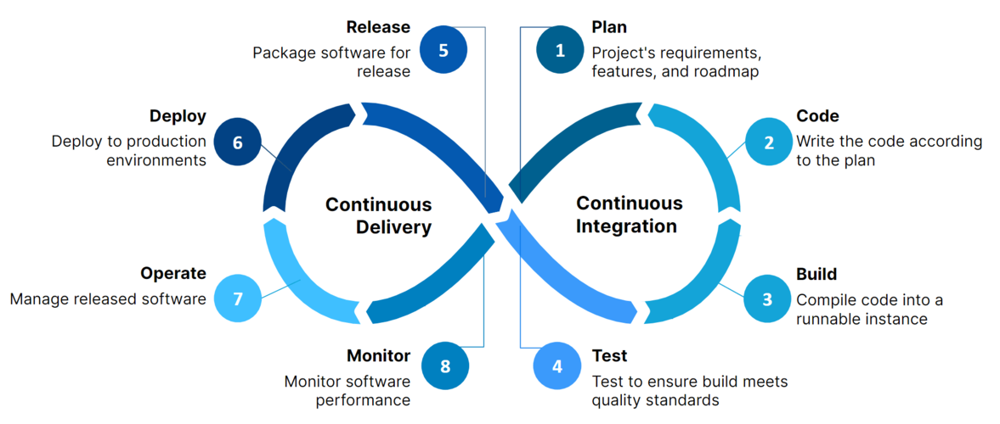
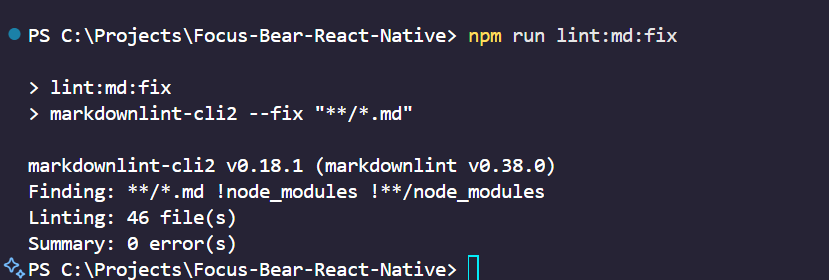

# Continuous Integration & Continuous Deployment (CI/CD)



CI/CD is a software development practice that aims to automate the process of integrating code changes, testing and deploying applications, to increase the development efficiency.

- Continuous Integration: Developers frequently merge their code into a shared repository. Automated builds and tests run to detect issues early.
- Continuous Deployment: Once code passes testing, it’s automatically deployed to production or staging environments

This ensures that we catch bugs during early development stages and more importantly, reduce the amount of manual effort in deploying and testing.

## How does automating style checks improve project quality?
Automating style and lint checks (e.g., ESLint, Prettier, markdownlint) ensures that all code follows the same conventions and quality standards. Any developer working on the same repo, will follow the same conventions. This massively improve the team's:

- Code Style Consistency as the team maintains a uniform code style across the team
- Code Readability as it is well formatted
- Prevent any small errors such as unused variables or missing imports.

## Setting up markdown

[Markdown Lint YAML file](https://github.com/StuvanFIT/Focus-Bear-React-Native/blob/main/.github/workflows/markdown-check.yml)


`.markdownlint-cli2.json` configuration. Note that I disabled some checks to align with my practices


Running the markdown linting check:



Setting automated markdown linting checks in pull requests:

[LINK TO PULL REQUEST](https://github.com/StuvanFIT/Focus-Bear-React-Native/pull/90)


## Briefly describe any issues you faced when setting up the pipeline or git hooks, and how you resolved them

One thing ive struggled with when setting up the markdown YAML file was misalignments in one of the - name: or run: lines. I consistently got errors such as

```
YAML syntax error: mapping values are not allowed in this context
```

I resolved them by running `npx actionlint` (this checks for YAML + workflow syntax issues) and manually checking the indentation spaces for each line.

## What are some challenges with enforcing checks in CI/CD?

Some challenges in enforcing CI/CD is that it can lead to many false positives which can get really tiresome. For example, linters or tests may block merges for minor issues or irrelevant warnings. Strict pipelines can frustrate developers if they block progress for very trivial reasons. Sometimes, CI/CD linting cannot automatically fix any linting issues and you would have to manually refactor them line by line. This becomes bothersome in a very large codebase with multiple linted files.

However, in this case, we can configre your linting tools by restricting or ignoring certain errors. For example, in the `.markdown.jsonc` configuration, you can ignore certain error codes to suit your teams styling.

So the key here to note is finding a balance between automation and developer efficiency.

## How do CI/CD pipelines differ between small projects and large teams?

| **Aspect** | **Small Projects** | **Large Projects** |
|-------------|--------------------|-------------------------------|
| **Complexity** | Simple pipelines (build, test, deploy) | Multi-stage pipelines with multiple environments |
| **Tools** | Basic setups using GitHub Actions, Travis CI, or Netlify | Advanced systems like Jenkins, CircleCI, GitLab CI/CD |
| **Testing Scope** | Few unit/integration tests | Full automated test suites (unit, integration) |
| **Deployment Frequency** | Manual or semi-automated | Fully automated, continuous deployment |
| **Team Collaboration** | One or few contributors | Multiple teams, requiring branch protections, approvals, and environments |
| **Error Handling** | Rollbacks are often manual | Automated rollback and monitoring systems |

---
