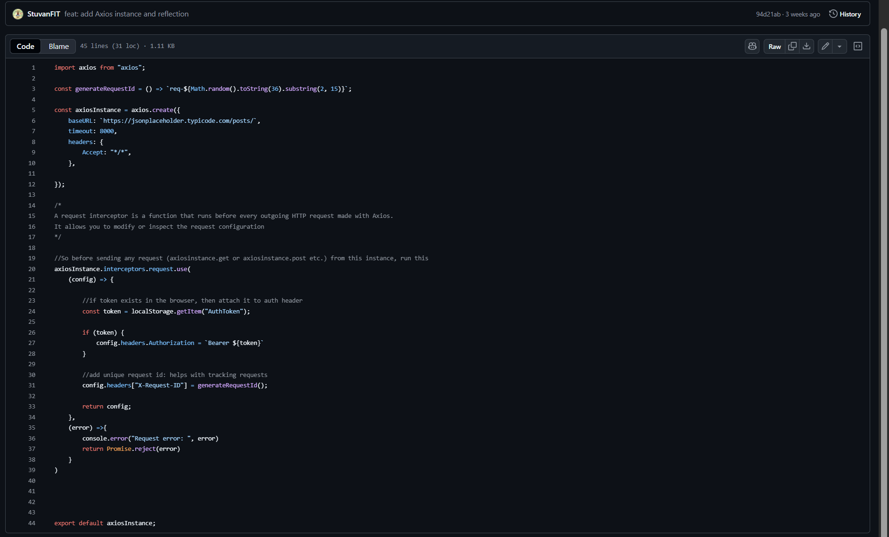
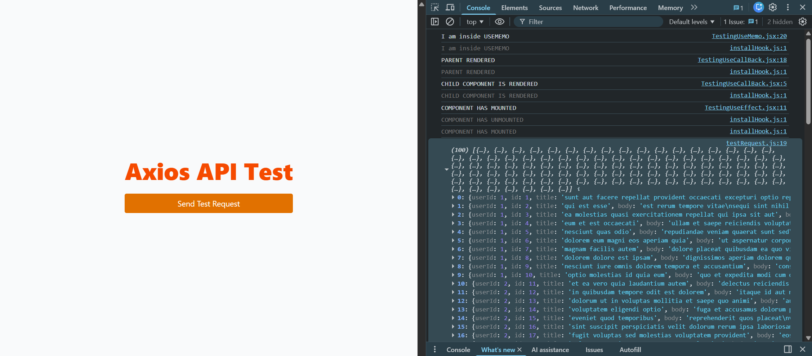
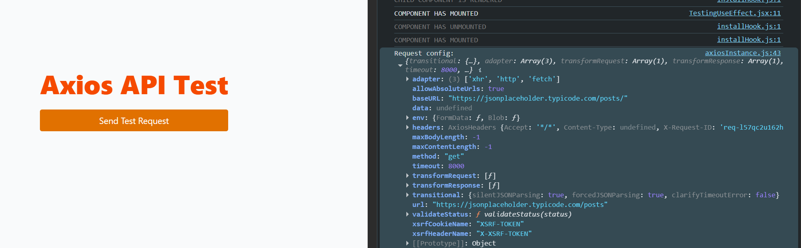
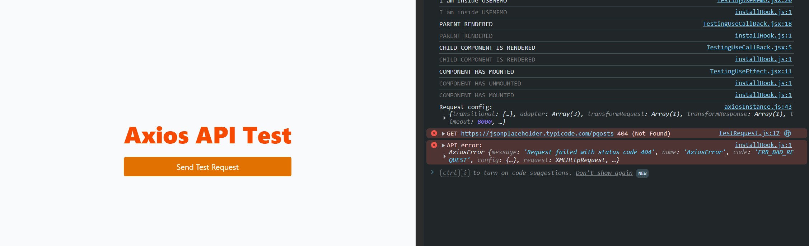

# Axios

[What is axios?](https://www.geeksforgeeks.org/html/what-is-axios/)

Axios is a popular open-source JavaScript library used to make HTTP requests from web browsers or Node.js environments. It simplifies the process of sending asynchronous HTTP Requests to REST endpoints.

The main features of AXIOS:

- Simplifies fetch() and simpler syntax
- Built in behaviour like throwing errors on 400 and 500 response codes and auto-parsing JSON; you have to implement this yourself with fetch.
- Allows you to create dedicated HTTP clients with headers, URLs etc built in so you dont have to supply the everytime
- Promises: Easier to handle asynchronous requests, especially with modern JS features such as async/await
- Interceptors: Allows you to intercept and modify requests or responses before they are handled by .then() or .catch()
- Automatic JSON parsing
- Supports all HTTP Methods

## Example of using Axios


[LINK TO AXIOS COMPONENT](https://github.com/StuvanFIT/Focus-Bear-React-Native/blob/main/milestones/5_React/my-project/src/ui/components/AxiosComponent.jsx)

We need to create an axios instace:



[LINK TO AXIOS INSTANCE](https://github.com/StuvanFIT/Focus-Bear-React-Native/blob/main/milestones/5_React/my-project/src/api/axiosInstance.js)

Then, we create a sample test request. This will be an API call. We will use the placeholder api testing site.


[LINK TO TEST REQUEST](https://github.com/StuvanFIT/Focus-Bear-React-Native/blob/main/milestones/5_React/my-project/src/api/testRequest.js)

Tested Output Response:



```
0
: 
{userId: 1, id: 1, title: 'sunt aut facere repellat provident occaecati excepturi optio reprehenderit', body: 'quia et suscipit\nsuscipit recusandae consequuntur …strum rerum est autem sunt rem eveniet architecto'}
1
: 
{userId: 1, id: 2, title: 'qui est esse', body: 'est rerum tempore vitae\nsequi sint nihil reprehend…aperiam non debitis possimus qui neque nisi nulla'}
2
: 
{userId: 1, id: 3, title: 'ea molestias quasi exercitationem repellat qui ipsa sit aut', body: 'et iusto sed quo iure\nvoluptatem occaecati omnis e…\nmolestiae porro eius odio et labore et velit aut'}
3
: 
{userId: 1, id: 4, title: 'eum et est occaecati', body: 'ullam et saepe reiciendis voluptatem adipisci\nsit … ipsam iure\nquis sunt voluptatem rerum illo velit'}
4
: 
{userId: 1, id: 5, title: 'nesciunt quas odio', body: 'repudiandae veniam quaerat sunt sed\nalias aut fugi…sse voluptatibus quis\nest aut tenetur dolor neque'}
5
: 
{userId: 1, id: 6, title: 'dolorem eum magni eos aperiam quia', body: 'ut aspernatur corporis harum nihil quis provident …s\nvoluptate dolores velit et doloremque molestiae'}
```

This is the requested Config:



Endpoint tested: `https://jsonplaceholder.typicode.com/posts`

Response: Array of post objects, successfully logged in console
Handled timeout via timeout: 8000 in axios instance
Handled request/response logging using interceptors

Handling Errors:



Reflection:

While testing Axios:

- The request condif was sucessfully logged onto the console and verified the headers, tokens and timeout.
- I verified that interceptors worked, logging every request and response. The timeout configuration successfully prevents hanging requests.
- Using the Axios instance simplified repeated calls, keeping the code DRY.
- Fetching posts from JSONPlaceholder returned a consistent response, and printing the response.data into the console.

This demonstrated practical application of Axios for making HTTP requests, handling responses, and maintaining clean code through reusable instances.

## Why is it useful to create a reusable Axios instance?

I found it useful to create an Axios instance as it:

- Centralises configuration (base URL, headers, timeouts) and easier to locate errors related to axios
- Keeps code DRY as there is no need to repeat setup for each API call
- Makes it easy to apply interceptors for auth or logging globally
- Better maintainability as we would only need to update one file

## How does intercepting requests help with authentication?

Lots of benefits in creating your intercepting request method:

- Automatically attach an access token to every outgoing request
- Handle errors (like 401 Unauthorised) in one place instead of in every component.This keeps your authentication logic consistent and secure across all API calls.

## What happens if an API request times out, and how can you handle it?

If the request were to time out due to exceeding the limit (i..e in our example, it was 8000ms), then you can handle it by:

- Catching the error in a try...catch block.
- Showing a friendly error message to the user via UI
- Redo the request and restart it or suggest to the user to check their configuration/connection
