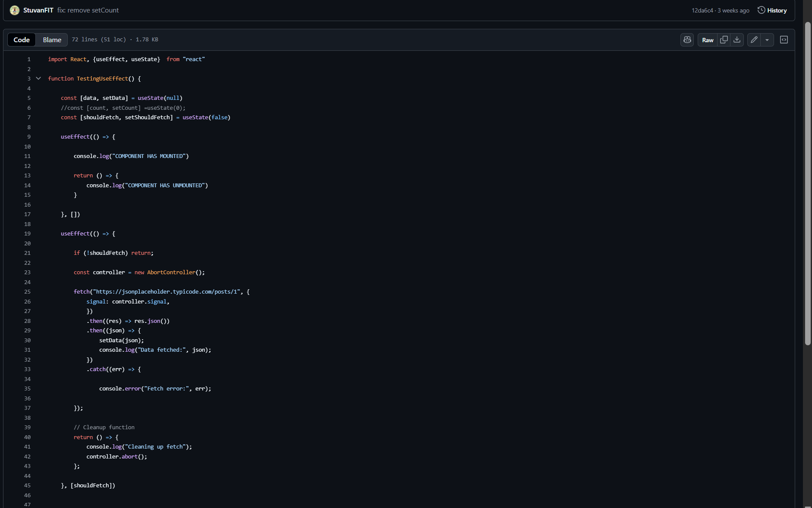
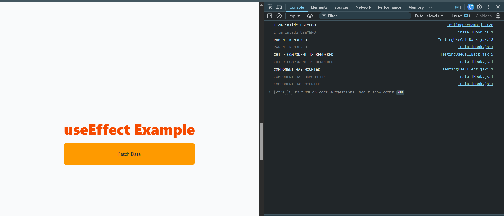
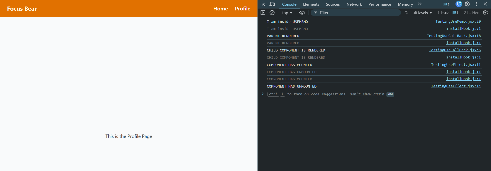
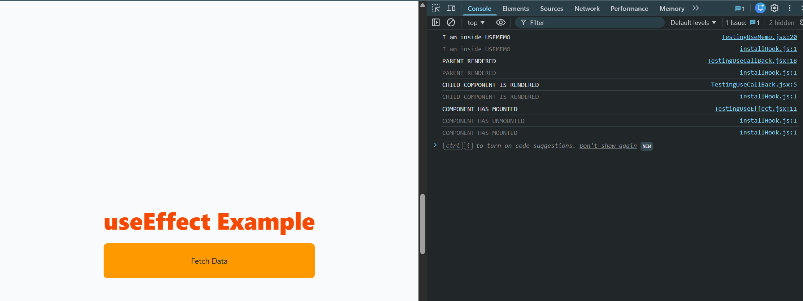
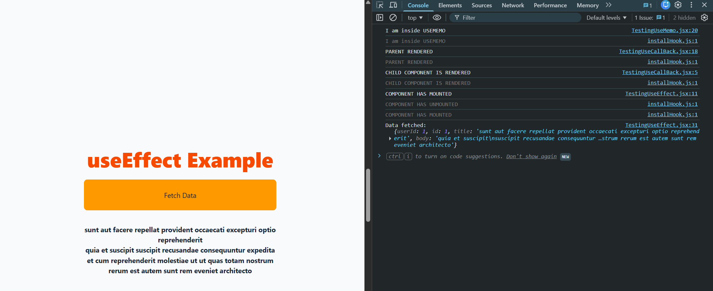
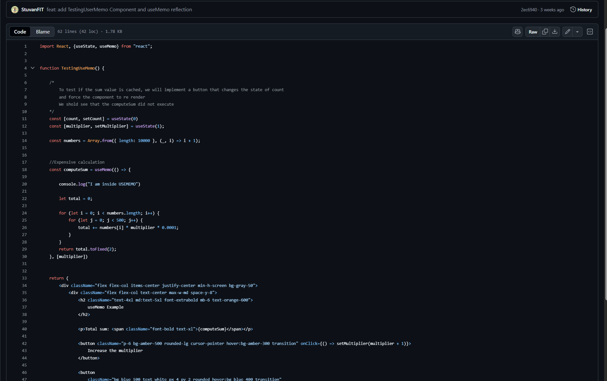
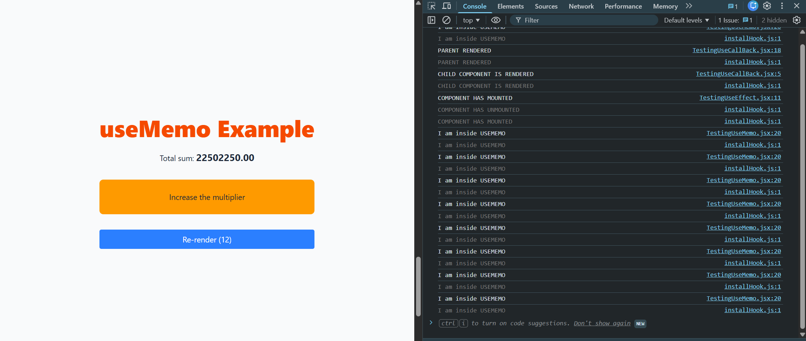
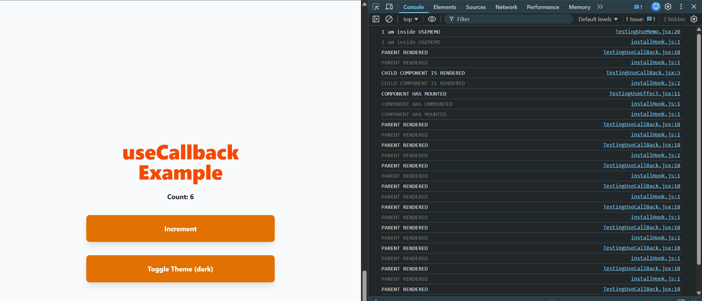

# React Hooks

## useEffect

useEffect is a react hook that allows function components to execute actions outside the component scope. This can include fetching data, turning on/off etc.

```
useEffect(() => {

  // Effect logic

  return () => {
    // Cleanup logic (runs before unmount or before the next effect)

  }
}, [any dependencies the hook should watch for])
```

The useEffect runs after the component renders.
There is also an optional dependency array that controls when your useEffect runs:

- []: an empty array means the useEffect runs once when mounted (and cleanup when unmounted)
- [value]: runs when specific values in the array have changed
- NO array: runs after every render

```
import React, {useEffect, useState}  from "react"

function TestingUseEffect() {

    const [data, setData] = useState(null)
    const [shouldFetch, setShouldFetch] = useState(false)

    useEffect(() => {

        console.log("COMPONENT HAS MOUNTED")

        return () => {
            console.log("COMPONENT HAS UNMOUNTED")
        }

    }, [])

    useEffect(() => {

        if (!shouldFetch) return;

        const controller = new AbortController();

        fetch("https://jsonplaceholder.typicode.com/posts/1", {
            signal: controller.signal,
            })
            .then((res) => res.json())
            .then((json) => {
                setData(json);
                console.log("Data fetched:", json);
            })
            .catch((err) => {
            
                console.error("Fetch error:", err);
                
        });

        // Cleanup function
        return () => {
            console.log("Cleaning up fetch (aborting request)");
            controller.abort();
        };

    }, [shouldFetch])


  return (
    <div className="flex items-center justify-center min-h-screen bg-gray-50">
        <div className="flex flex-col text-center max-w-md space-y-8">
            <h2 className="text-4xl md:text-5xl font-extrabold mb-6 text-orange-600">
                useEffect Example
            </h2>

            <button className="p-6 bg-amber-500 rounded-lg cursor-pointer hover:bg-amber-300 transition" onClick={() => setShouldFetch(true)}>
                Fetch Data
            </button>

            {data && (
                <div className="font-bold">
                    <h4>{data.title}</h4>
                    <p>{data.body}</p>
                </div>
            )}
        </div>
    </div>

  );
}

export default TestingUseEffect;
```

## Testing useEffect in practice

[LINK TO TestingUserEffect component](https://github.com/StuvanFIT/Focus-Bear-React-Native/blob/main/milestones/5_React/my-project/src/ui/components/TestingUseEffect.jsx)

Here, is the code for testing userEffect and mounting/unmounting. We have console logs and will tell us if the component/section has unmounted/mounted or not.





We can see that "COMPONENT HAS MOUNTED" text being printed, meaning that the component has sucessfulyl mounted. If I navigate to the Profile page we created earlier, then we can see that the "COMPONENT HAS UNMOUNTED".



## Before clicking the button (fetch api)



## After clicking the button (fetch api)



Here, we also implemented a cleanup function after we have finished fetching the data

```
// Cleanup function
return () => {
    console.log("Cleaning up fetch");
    controller.abort();
};
```

### When should you use useEffect instead of handling logic inside event handlers ?

It is recommended to utilise useEffect to handle side effects tied to the component’s lifecycle. This includes fetching data on mount or reacting to prop/state changes.

Event handlers are best for immediate user actions (like button clicks).
If your logic needs to run automatically when certain state or props change, it belongs inside a useEffect react hook.

### What happens if you don’t provide a dependency array?

If you omit ro do not provide a dependency array, the effect runs after every render, causing:

- Repeated side effects (like re-fetching data on every re-render)
- Potential infinite loops if the effect updates state each time.

```
useEffect(() => {
  setCount(count + 1); // causes another render each time since the count state has changed
});

and if u show it in the UI component like

{ count }

, then you can see the counter going upwards infinitely

But if u do this instead:

useEffect(() => {
  setCount(count + 1);
}, []); //it runs once

useEffect(() => {
  setCount(count + 1);
}, [value]); //it runs when value changes
```

### How can improper use of useEffect cause performance issues?

- Running effects too often (missing or incorrect dependencies) leads to unnecessary re-renders
- Triggering state updates inside effects without proper guards can create infinite loops.
- Can cause SSR (Server side rendering) issues
- Forgetting to clean up (like not clearing intervals or event listeners) causes memory leaks.

## useMemo

[React useMemo reference](https://react.dev/reference/react/useMemo)

useMemo is a react hook that let you cache the result of a calculation between re-renders.
It helps you avoid recalculating expensive values when the inputs (dependencies) haven’t changed.

For example:

```
const memoizedValue = useMemo(() => computeExpensiveValue(a, b), [a, b]);
```

React will only run this function when the dependencies a or b change state. However, on other renders, React reuses the cached result. So, this can be very useful for expensive or costly components that require heavy computation or derived data that doesn’t need to be recomputed on every render.

"During next renders, it will either return an already stored value from the last render (if the dependencies haven’t changed), or call calculateValue again, and return the result that calculateValue has returned."

If you do not provide the dependency array:

```
const memoizedValue = useMemo(() => computeExpensiveValue(a, b));
```

then React computes this function every render.
That means:

The function inside useMemo runs every single time your component renders. There is no memoization benefit at all as it behaves just like a normal function call.

So effectively, it’s the same as:

```
const memoizedValue = computeExpensiveValue(a, b);
```

## Example of using useMemo

[LINK TO TestingUseMemo Component](https://github.com/StuvanFIT/Focus-Bear-React-Native/blob/main/milestones/5_React/my-project/src/ui/components/TestingUseMemo.jsx)



```
import React, {useState, useMemo} from "react";


function TestingUseMemo() {

    /*
        To test if the sum value is cached, we will implement a button that changes the state of count
        and force the component to re render
        We shold see that the computeSum did not execute again
    */
    const [count, setCount] = useState(0)
    const [multiplier, setMultiplier] = useState(1);

    const numbers = Array.from({ length: 10000 }, (_, i) => i + 1);


    //Expensive calculation
    const computeSum = useMemo(() => {

        console.log("I am inside USEMEMO")

        let total = 0;

        for (let i = 0; i < numbers.length; i++) {
            for (let j = 0; j < 500; j++) {
                total += numbers[i] * multiplier * 0.0001;
            }
        }
        return total.toFixed(2);
    }, [multiplier])


    return (
        <div className="flex flex-col items-center justify-center min-h-screen bg-gray-50">
            <div className="flex flex-col text-center max-w-md space-y-8">
                <h2 className="text-4xl md:text-5xl font-extrabold mb-6 text-orange-600">
                    useMemo Example
                </h2>

                <p>Total sum: <span className="font-bold text-xl">{computeSum}</span></p>

                <button className="p-6 bg-amber-500 rounded-lg cursor-pointer hover:bg-amber-300 transition" onClick={() => setMultiplier(multiplier + 1)}>
                    Increase the multiplier
                </button>

                <button
                    className="bg-blue-500 text-white px-4 py-2 rounded hover:bg-blue-400 transition"
                    onClick={() => setCount(count + 1)}
                >
                    Re-render ({count})
                </button>
            </div>

        </div>
    )


}

export default TestingUseMemo;
```

Running useMemo:



To test if the sum value is cached, we will implement a button that changes the state of count
and force the component to re render. We should see that the computeSum did not execute and we used the previous value.

When clicking “Re-render”, the component re-renders but the console does not log "I am inside USEMEMO", confirming that the previous computation was cached and not recalculated.
However, clicking “Increase the multiplier” triggers "I am inside USEMEMO" again because the dependency (multiplier) changed, causing React to recompute the value.

This exercise clearly showed how useMemo improves performance in React when dealing with expensive computations.
Initially, when I removed useMemo, the console logged "I am inside USEMEMO" every time I re-rendered and even if the multiplier didn’t change. The UI became noticeably slower and lagged slightly due to the repeated nested loops running thousands of iterations.

After adding useMemo, React only recomputed when the multiplier dependency changed, keeping the app responsive. This reinforced my understanding that useMemo should be used selectively for heavy computations to prevent unnecessary work and improve render performance.

### How does useMemo improve performance?

useMemo aims to improve performance by caching the result of the previous/latest computation. Extremely useful for costly computations.

If the dependencies haven’t changed, React reuses the previous result instead of recomputing it. This reduces unnecessary CPU work and makes re-renders faster, especially with large lists/arrays and complex operations.

### When should you avoid using useMemo?

- If the computation or calcualtion is very inexpensive or lightweight. Using memoisation for simple tasks can actually degrade performance
- The dependencies change frequently. React will re-run the calculation anyway

### What happens if you remove useMemo from your implementation?

If we remove useMemo from the above example, then the `computeSum` will run every rerender, even though the dependencies havent changed. So this would lower the performance of the application.

## useCallBack

[useCallBack docs](https://react.dev/reference/react/useCallback)

useCallback is a React Hook that lets you cache a function definition between re-renders. It does this by returning a memoised version of the function, keeping the same function reference between re-renders unless one of its dependencies change.

## Example of TestingUseCallBack

[LINK TO GITHUB USECALLBACK COMPONENT](https://github.com/StuvanFIT/Focus-Bear-React-Native/blob/main/milestones/5_React/my-project/src/ui/components/TestingUseCallBack.jsx)


Without useCallback:

- Toggling the theme state caused both the parent and the child to re-render.
- In the console, you can see ChildButton logging "CHILD COMPONENT IS RENDERED" on every parent re-render, even though the child’s output did not change.



With useCallback:

- Wrapping handleIncrement with useCallback and memoiding ChildButton ensures the child does not re-render when the theme toggles.
- Only the parent re-renders. The console confirms this with no new logs from the child.

Reflection:

When testing this component, I initially observed that toggling the theme caused unnecessary re-renders of the child, even though the button’s behavior and UI didn’t change. But after wrapping handleIncrement with a useCallBack and memoising the child button component, there was a clear improvement: no child re-renders and console logs messages were expected.

THis shows that how `useCallback` combined with memo helps optimise performance in real scenarios, especially with expensive child components or large lists.

### What problem does useCallback solve?

Normally in React, functions are recreated every time a component re-renders.
When you pass a function as a prop to a child component, this causes the child to re-render even if nothing actually changed because the function reference is new.

useCallback prevents unnecessary re-renders of child components by ensuring the same function reference is passed between renders. It’s especially useful when:

- A child component is wrapped with `memo`.
- A function is passed down as a prop and could trigger re-render loops.

Example: not using `useCallBack`

```
import React, { useState, memo } from 'react';

//Child component that logs when it re-renders
const ChildButton = memo(({ onClick }) => {
  console.log('CHILD COMPONENT IS RENDERED');
  return <button onClick={onClick}>Increment</button>;
});

const TestingUseCallBack = () => {
  const [count, setCount] = useState(0);
  const [theme, setTheme] = useState('light');

  //This function is re-created every time the parent re-renders.
  const handleIncrement = () => {
    setCount((prev) => prev + 1);
  };

  console.log('PARENT RENDERED');

  return (
    <div className="p-6">
      <h2>Count: {count}</h2>
      <ChildButton onClick={handleIncrement} />

      <button onClick={() => setTheme(theme === 'light' ? 'dark' : 'light')}>
        Toggle Theme ({theme})
      </button>
    </div>
  );
};

export default TestingUseCallBack;
```

In this example, we can toggle the theme button b/w light and dark mode. When you click on Toggle Theme, only the theme state
changes.

However, the PARENT COMPONENT re-renders. This leads to:

1. A new instance of handleIncrement
2. The child (ChildButton) receives a new prop reference (onClick = {handleIncrement})
3. Even though nothing about the child’s output changed, React re-renders it because its prop reference changed.

Note: we also need `memo` wrapping around the child component props. `memo` is a higher order component that wraps another component (in this case, its the child button). It tells React that it should only re-render the child component if the props
change. So if the parent re-renders but the props to the child hasnt changed, it will skip re-rendering.

So even if we use `useCallBack` with no `memo`, the child component will still render. React always re-renders children of a component that re-renders, unless you explicitly prevent it.

TLDR: Because React by default always re-renders all children of a parent that re-renders

Example: Using `useCallBack`

```
import React, { useState, memo, useCallBack} from 'react';

//Child component that logs when it re-renders
const ChildButton = memo(({ onClick }) => {
  console.log('CHILD COMPONENT IS RENDERED');
  return <button onClick={onClick}>Increment</button>;
});

const TestingUseCallBack = () => {
  const [count, setCount] = useState(0);
  const [theme, setTheme] = useState('light');

  //This function is re-created every time the parent re-renders.
  const handleIncrement = useCallback(() => {
    setCount((prev) => prev + 1);
  }, []);

  console.log('PARENT RENDERED');

  return (
    <div className="p-6">
      <h2>Count: {count}</h2>
      <ChildButton onClick={handleIncrement} />

      <button onClick={() => setTheme(theme === 'light' ? 'dark' : 'light')}>
        Toggle Theme ({theme})
      </button>
    </div>
  );
};

export default TestingUseCallBack;
```

So this time, you will only see the "PARENT RENDERED" console message. The child no longer re-renders, because the handleIncrement function reference stays the same.

### How does useCallback work differently from useMemo?

useCallback returns a MEMOISED FUNCTION and is used when you want to prevent re-rendering of a function by caching the function reference.

useMemo returns a MEMOISED VALUE and is more useful in applications where you want to cache an expensive computation result.

TLDR: useCallback memoises FUNCTIONS and useMEMO memoises VALUES.

### When would useCallback not be useful?

- If the function isn’t passed to a child or doesn’t cause re-renders. It would be unnecessary.
- Overusing it can make code harder to read without improving performance.
- Adds unnecessary complexity if the application is small
