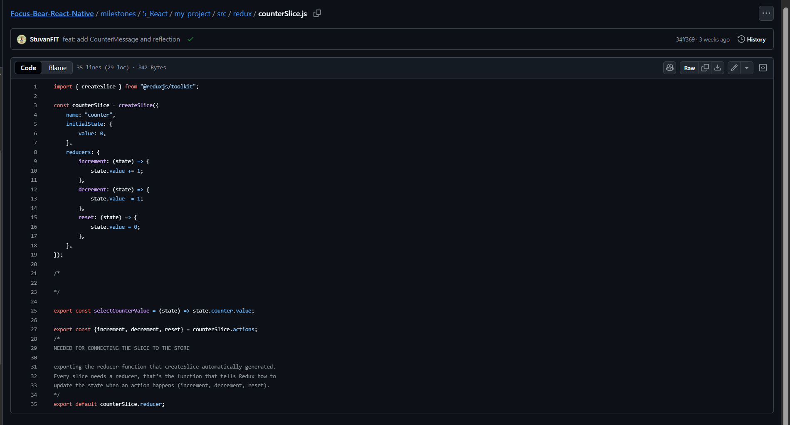
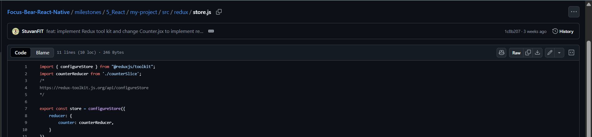
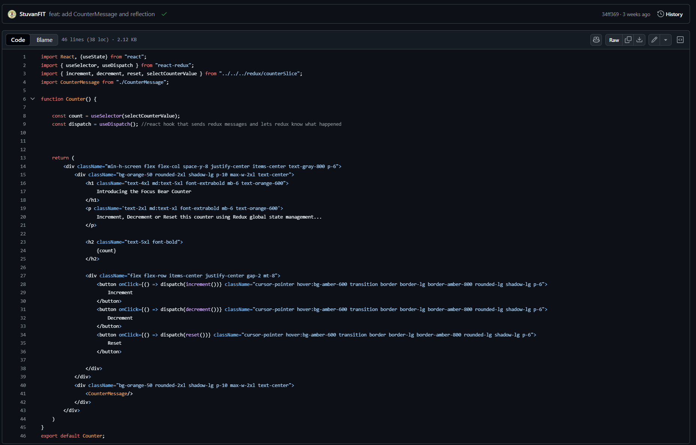
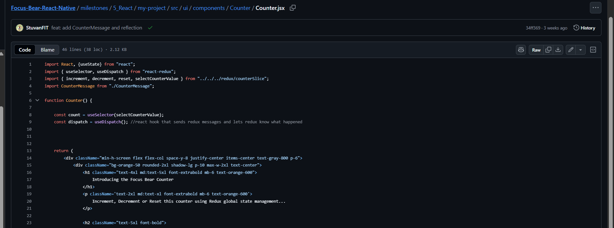
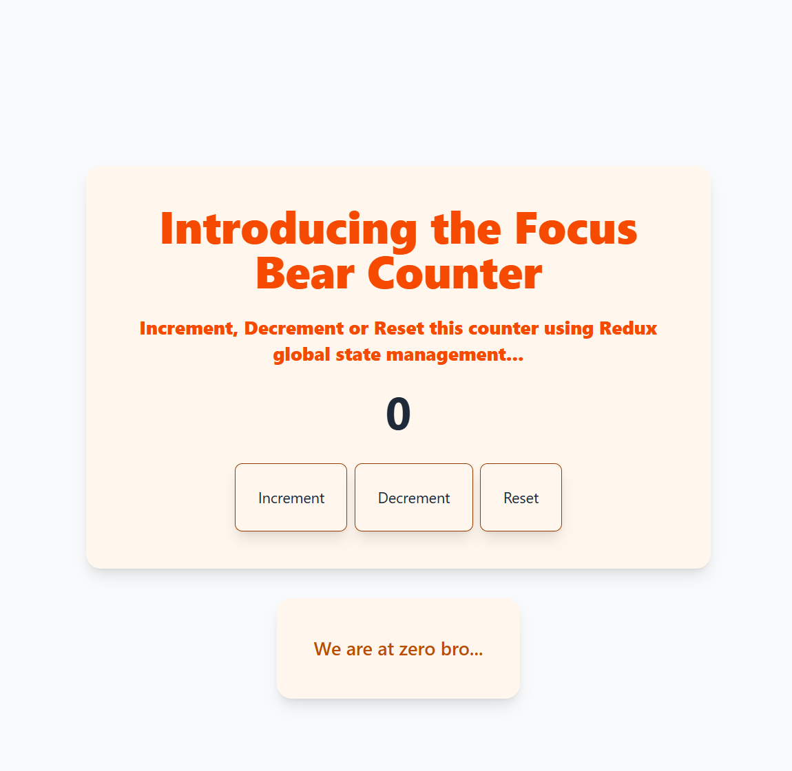
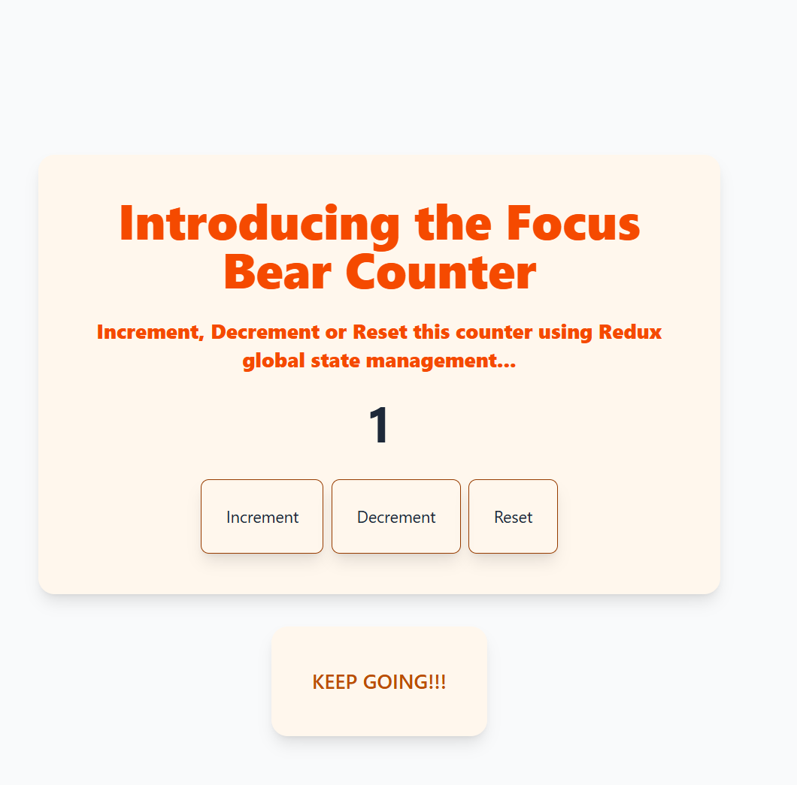
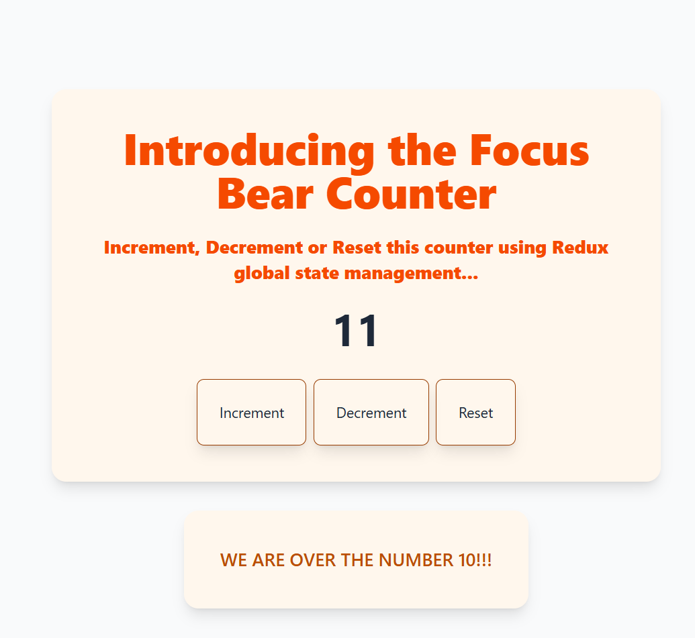
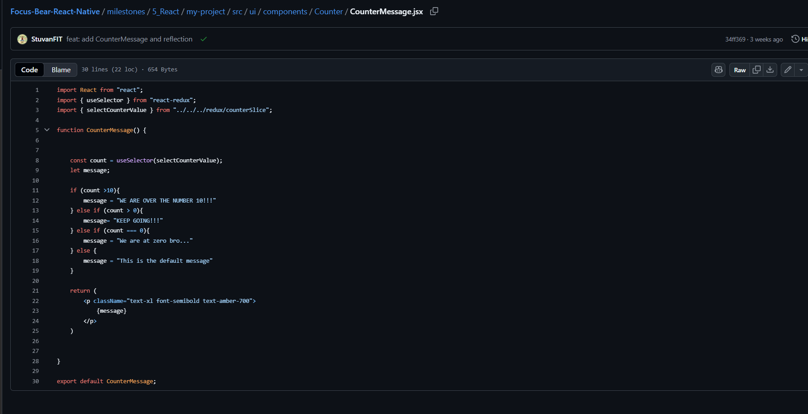

# Redux

## What is Redux toolkit?

Redux is a toolkit that allows developers to manage global states that are accessible to all components.

Reduxis is built around 3 major principles:

- Store
- Actions
- Reducers

Stores:

- The store is the single source of truthit holds all the global state of your application. Components read and update values in the store.

Actions:

- Actions describe what happened, they are plain JavaScript objects with a type and an optional payload.
- Think of them as messages you send to the store saying “something changed”.

Reducers:

- Reducers describe how the state changes in response to an action.
- They take the current state and an action, and return a new state.

NOTE: Reducers do not directly modify the state value. Instead, they copy the state and replace the original state with the new value. Redux does not work if you direclty mutate the state. You need to copy the state, modify it and replace the old state

### How to setup Redux Store

[Redux Store Video Tutorial](https://www.youtube.com/watch?v=5yEG6GhoJBs)

## createSlice

createSlice is a helper function from Redux toolkit that automatically creates a:

1. Slice of a state
2. A set of reducer functions that update the sliced state
3. The action creators that trigger those reducers

### Without createSlice

Without using createSlice, you would need to write a lot of boilerplate:

```
const INCREMENT = "Increment"

function Increment() {
    return {type: INCREMENT}
}

function counterReducer(state:{value:0}, action) {
  switch (action.type) {
    case INCREMENT:
      return { value: state.value + 1 };
    default:
      return state;
  }
}
```

### With createSlice



[LINK TO counterSlice File on Github](https://github.com/StuvanFIT/Focus-Bear-React-Native/blob/main/milestones/5_React/my-project/src/redux/counterSlice.js)

We can simplify all of the above by doing this:

```
const counterSlice = createSlice({
    name: "counter", // used to prefix action types, e.g. "counter/increment"
    initialState: {value: 0}, // default state for this part of the store
    reducers: {
        increment: (state) => { state.value += 1 },
        decrement: (state) => { state.value -= 1 },
        reset: (state) => { state.value = 0},
    },
})

```

The action types would be generated:

```
"counter/increment"
"counter/decrement"
"counter/reset"
```

then, you can use those actions by exporting

```
export const { increment, decrement, reset } = counterSlice.actions;
```

### configureStore



[LINK TO configureStore](https://github.com/StuvanFIT/Focus-Bear-React-Native/blob/main/milestones/5_React/my-project/src/redux/store.js)

### Full Example of using Redux tools: createSlice and configureStore in a react component



Pushed to the repo:

[Counter.jsx File Git link](https://github.com/StuvanFIT/Focus-Bear-React-Native/blob/main/milestones/5_React/my-project/src/ui/components/Counter/Counter.jsx)

## When should you use Redux instead of useState?

Developers should use Redux instead of useState when:

1. State needs to be shared across multiple components
  If several parts of your application depend on the same state (user data or theme), Redux provides a single source that prevents prop drilling.

2. Centralised State Management. You want your states to be managed by actions and reducer and this would help with tracking bugs and issues easily.

3. If your application becomes complex, then using useState in multiple components can become hard to manage. Redux scales better and enforces a consistent structure.

So TLDR: Use `useState` for simple, **local component states** like form inputs, toggles, or temporary UI states when no other components need access to that state. Use **Redux** when your app state is shared, global, or needs strong structure and traceability

## Something to note

Redux passes the `state` automatically to the reducers. It is under the hood.

useSelector calls the selector automatically every time Redux state changes. It passes the entire store state into the selector function:

```
export const selectCounterValue = (state) => state.counter.value;
```

This function expects the entire store state object as its argument, and simply returns the part of it you care about (state.counter.value)

## `useSelector` Example

TO increase code reusability, we will use useSelector here to make it more organised instead of letting the Counter component handle it.

```
export const selectCounterValue = (state) => state.counter.value;
```



Value is 0:



Greater than 1:



Over 10:



Then, depending on the counter value, we will show a specific message:



Reflection:

- Increased reusability: I was able to use the same selectCounterValue selector in both Counter and CounterMessage components. No need to duplicate logic.
- Improved readability: By abstracting the state logic into a selector, the components only focus on rendering, making the code cleaner and easier to understand.
- Easier refactoring: When I changed the state structure in counterSlice, I only had to update the selector. All components using it automatically worked without changes.
- Debugging improvement: When inspecting Redux DevTools, it was easier to track which components relied on the counter value and how re-renders occurred.

TLDR: Using selectors made my workflow faster, reduced bugs, and made the codebase more maintainable.

## What are the benefits of using selectors instead of directly accessing state?

Using selectors provide many benefits and moslty improvement of code structure, more organised and maintainable in the future.

1. Increase code reusability. The same selector can be reused across multiple components to access consistent data.

2. Increase code readability. Selectors make it clear what part of the state a component depends on, improving code clarity.

3. Updating only in one place. If the state structure changes later, you only update the selector and not every component. This results in easier bug fixing and refactoring sessions.
