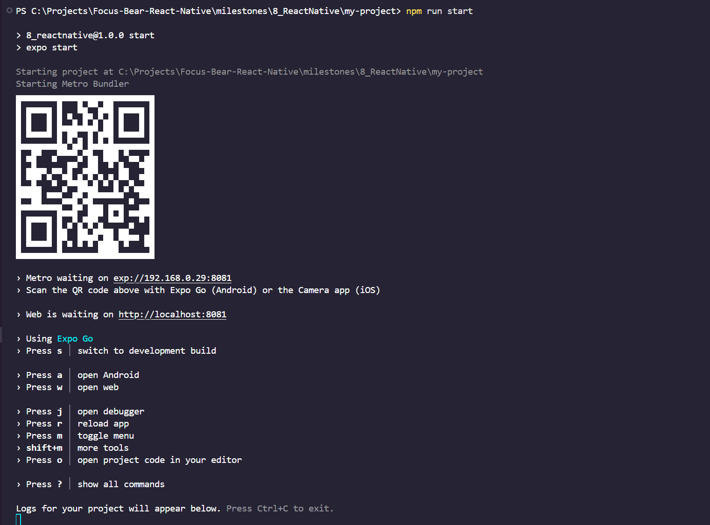

# React Native Environment Setup Reflection

[Video Tutorial on how to set up React Native](https://www.youtube.com/watch?v=J2j1yk-34OY)

### What is the role of Metro in React Native development?

[Metro docs](https://reactnative.dev/docs/metro)

[Why use Metro?](https://docs.expo.dev/guides/why-metro/)

**Metro** is the JavaScript bundler that comes with React Native setup.  
Its main task is to watch your files, compiles JavaScript code (including JSX and TypeScript), and bundles it into a single file the React Native runtime can execute.

Metro takes all your JavaScript files, their dependencies, and any assets (like images or fonts) and combines them into one or more optimised bundles. This process ensures that all necessary code and resources are available when your application runs.

Metro also supports **fast refresh (hot reloading)**, so changes in your code update instantly in the app without a full rebuild.

So essentially, Metro bundles and serves the JS code and assets to the emulator/device.

### How does Expo/Expo Go simplify React Native development?

[Expo Go Docs](https://expo.dev/go)

The EXPO-REACT NATIVE relationships is similar to the relationships of NEXT JS AND REACT.

Expo is a framework and platform that makes React Native development faster and easier by handling most of the native setup for you. Expo abstracts away native configuration, so developers can focus on writing React Native code. Also, to run your application we use Expo GO app. Expo GO is a sandbox that enables you to quickly experiment with building native Android and iOS apps. It's the fastest way to get started and preview apps using a QR Code.

With Expo, you can:

- Run apps on your device without installing Android Studio (android) or Xcode (ios)
- Use built-in APIs and tool kits (camera, notifications, sensors) without native code
- Publish or share your app easily via a QR code
- Expo Go allows for easier testing of your application as well!
- Expo integrates seamlessly with the metro bundler which enables: hot reloading (instant updates on save) and fast refresh (keeps component state while editing)
- NO NEED FOR NATIVE BUILDS AND SAVES TIME
- Easier and faster test builds via QR CODES

### Personal Setup Details

- OS/IDE: Windows 10, VS Code
- Node & Expo CLI: Node v20, npm v9, Expo CLI installed globally
- Installed EXPO GO from app store

Command used to start Metro:


```
expo start
```

or

```
npm run start
```

Metro and Expo setup works fine:



Opened Expo Go on Android device and scanned QR code to launch app and verified app loads successfully with hot reload working:


- Hot reload & fast refresh. I edited a simple Text component in App.js and saw the changes reflected instantly on my device without losing state.

- Minor hurdles: Initially forgot to allow VS Code to access Node path in my terminal, which caused expo start to fail. Resolved by restarting VS Code and ensuring environment variable included Node.

- Observations: Using Expo + Metro significantly reduced setup time compared to configuring Android Studio and Xcode manually. Ive used Swift and needed Xcode to design IOS apps but was slow and felt too restrcited. It allowed me to quickly focus on React Native components rather than environment setup.

### What issues did you encounter, and how did you resolve them?

During my setup, I didnt face any major issues as it was pretty clear and intuitive with the help of the above tutorial.
