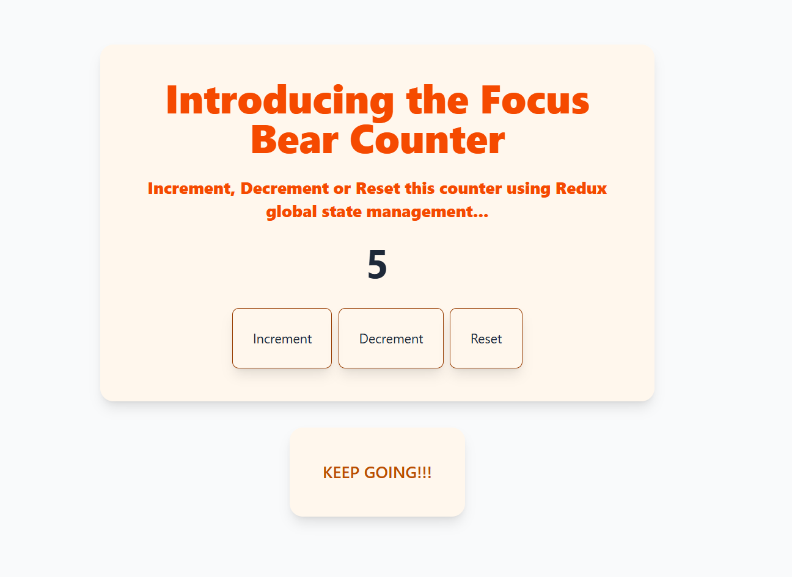
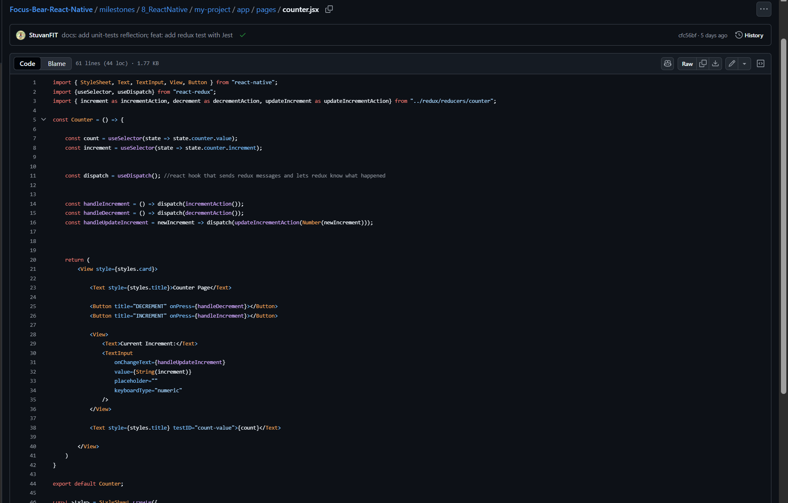
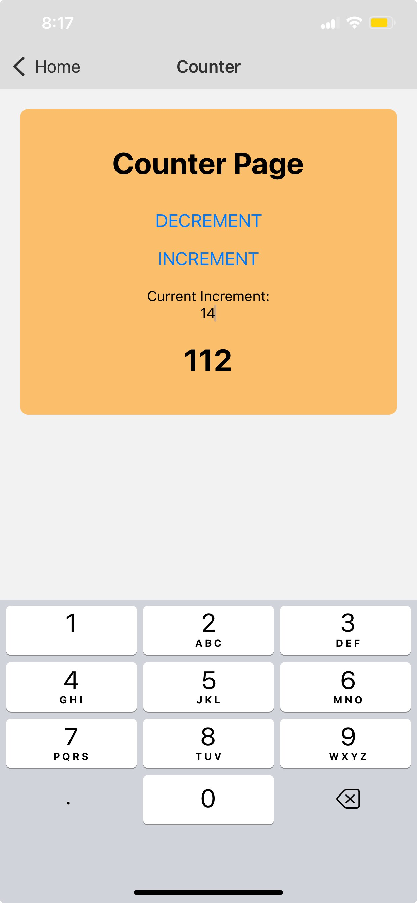

# React Native

## Components

### Key differences between `<View>` and `<div>`

div is a web container element rendered in the browser DOM. It has no inherent semantic meaning beyond acting as a division or section within a document and used to group and structure content together

On the otherhand, View is a native container component that maps to platform-specific UI elements (e.g. UIView on iOS, View on Android). It is a fundamental building block for creating user interfaces.

The View component in React Native is the equivalent of a div in HTML. It's a container for other components and provides styling and layout properties. They serve the same purpose, grouping and laying out elements,  but run in different environments.

Here are some things to note:

Layout:

- div supports multiple layout systems (block, grid, flexbox, etc.). SO DIV SUPPORTS FULL CSS.
- View only supports Flexbox for layout

Styling system:

- div uses CSS and classname
- View uses the style prop and stylesheets

### How does `StyleSheet.create()` improve performance compared to inline styles?

- `StyleSheet.create()` precomputes the styles and sends them to native code side **ONLY ONCE**, rather than recalculating them on every render.  
- Inline styles are objects recreated on each render, which can be less efficient for complex or way larger layouts

### Why doesn’t React Native use `className` like React web?

- React Native doesn’t have a browser DOM, so there’s no concept of CSS classes. THe concept of className comes from HTML AND CSS. SO instead of CSS files, React native used JS objects to describe styles  
- Styles are applied directly to native components via the style prop and StyleSheet.create().  
- This ensures a consistent, platform-agnostic styling approach.

### Refactoring React Component -> React Native Component

#### React Version


[Counter.jsx File Git link](https://github.com/StuvanFIT/Focus-Bear-React-Native/blob/main/milestones/5_React/my-project/src/ui/components/Counter/Counter.jsx)



#### React Native Version



[LINK TO REACT NATIVE Counter.jsx](https://github.com/StuvanFIT/Focus-Bear-React-Native/blob/main/milestones/8_ReactNative/my-project/app/pages/counter.jsx)

```
import { StyleSheet, Text, TextInput, View, Button } from "react-native";
import {useSelector, useDispatch} from "react-redux";
import { increment as incrementAction, decrement as decrementAction, updateIncrement as updateIncrementAction} from "../redux/reducers/counter";

const Counter = () => {

    const count = useSelector(state => state.counter.value);
    const increment = useSelector(state => state.counter.increment);


    const dispatch = useDispatch(); //react hook that sends redux messages and lets redux know what happened


    const handleIncrement = () => dispatch(incrementAction());
    const handleDecrement = () => dispatch(decrementAction());
    const handleUpdateIncrement = newIncrement => dispatch(updateIncrementAction(Number(newIncrement)));


    return (
        <View style={styles.card}>
            
            <Text style={styles.title}>Counter Page</Text>

            <Button title="DECREMENT" onPress={handleDecrement}></Button>
            <Button title="INCREMENT" onPress={handleIncrement}></Button>
            
            <View style={styles.incrementSection}>
                <Text>Current Increment:</Text>
                <TextInput
                    onChangeText={handleUpdateIncrement}
                    value={String(increment)}
                    placeholder=""
                    keyboardType="numeric"
                />
            </View>

            <Text style={styles.title} testID="count-value">{count}</Text>
            
        </View>
    )
}

export default Counter;

const styles = StyleSheet.create({
    card: {
        padding:16,
        borderRadius: 8,
        backgroundColor: "#FBBF6B",
        alignItems: "center",
        margin:20
    },

    title: {
        fontSize: 30,
        fontWeight: "bold",
        textAlign: "center",
        margin: 20,
    },
    incrementSection: {
        flexDirection: "column",
        alignItems: "center",
        textAlign: "center",
        marginTop: 10,
        fontWeight: "bold"
    }
})
```

Output on ExpoGo:



Reflection:

I noticed that it is quite difficult to use tailwind css in react native and apparently does not integrate well with react native (mixed reviews). I normally like to use tailwind css and it makes writing css more fun and enjoyable for me. This is why I enjoy writing css styling in React projects as most of the time, Im using tailwind css. However, in this react native refactoring, I had to use standard CSS, which was quite a pain since I forgot some of the syntax. However, I do like there is a style sheet for each component file, which keeps everything modularised and clean and I like the idea of assiginng different sections a style sheet item as it keeps the code clean instead of writing inline css code.
