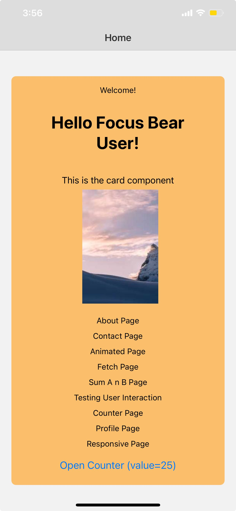
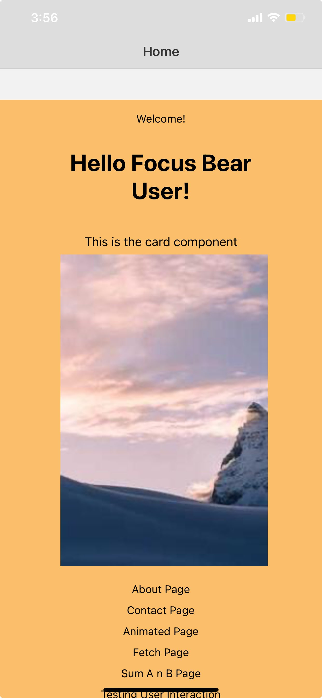
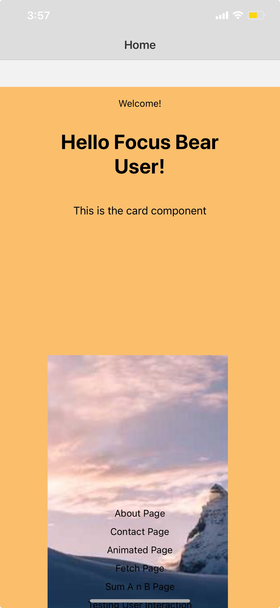
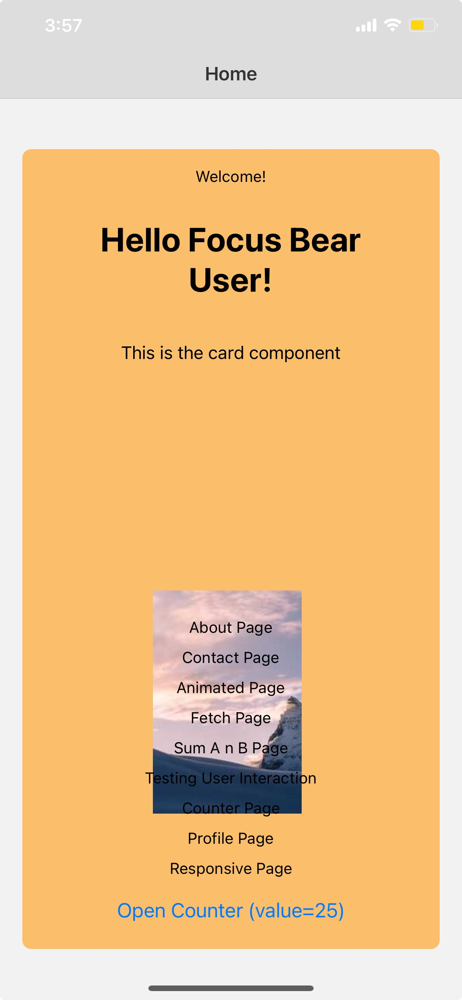

# React Native Animations

## Gesture Handling (`react-native-gesture-handler`)

Install via the [expo react native gesture handler docs](https://docs.expo.dev/versions/latest/sdk/gesture-handler/)

`react-native-gesture-handler` is a library that provides high-performance gesture recognition for React Native apps.
It moves gesture handling from the JavaScript thread to the native layer, making gestures more fluid and reliable.

Common gestures you would see nowadays:

- TapGestureHandler: detect single/double taps
- LongPressGestureHandler: trigger after holding down
- PanGestureHandler: drag or swipe gestures
- FlingGestureHandler: detect fast flicks or swipes

```
import { PanGestureHandler } from 'react-native-gesture-handler';
import { View } from 'react-native';

<PanGestureHandler onGestureEvent={onPanGesture}>
  <View style={{ width: 100, height: 100, backgroundColor: 'skyblue' }} />
</PanGestureHandler>
```

### Well, why do we need this? How does react-native-gesture-handler improve gesture performance?

It prevents gesture lag and conflict (e.g., scrolling vs dragging) by handling input natively, ensuring a smoother, more predictable user experience.

The default React Native touch system processes gestures through the JavaScript thread, which can cause delays or missed touches if the JS thread is busy.

`react-native-gesture-handler` moves gesture recognition to the native layer/ui thread, making gestures:

- More responsive (no lag even under heavy computation)
- More accurate (prevents gesture conflicts)
- Composable (you can mix multiple gestures like drag + swipe + tap)

### When would you use gestures instead of buttons in a UI?

Gestures are used when you want natural, fluid, or continuous interactions instead of simple clicks. Whilst buttons
should be more for actions like submitting forms etc..

For example, we would use gestures when:

- You want to save screen space
- You want natural UX mimicking real-world behavior (like tinder swiping)
- You want continuous feedback

## Animations (`react-native-reanimated`) (UI THREAD)

Install via the [expo react native reanimated docs](https://docs.expo.dev/versions/latest/sdk/reanimated/)

An advanced animation library that runs animations on the UI thread (not JS), enabling buttery-smooth, interruptible, and gesture-linked animations.

Use react-native-reanimated For high-performance, gesture-based, or complex animations (like draggable components, interactive transitions, etc.)

## React native gesture handler + react native reanimated example

```
import { StyleSheet, Text, View, Image, Button, ScrollView } from "react-native";
import { Link, useRouter } from "expo-router";
import Animated, {useAnimatedStyle, useSharedValue, withSpring} from "react-native-reanimated";
import { Gesture, GestureDetector } from "react-native-gesture-handler";

export const CustomText = ({ children }) => <Text>{children}</Text>;

const Home = () => {
    const router = useRouter()
    const imageSize = 200
    const translateX = useSharedValue(0)
    const translateY = useSharedValue(0)
    const scaleImage = useSharedValue(imageSize)


    const doubleTap = Gesture.Tap()
        .numberOfTaps(2)
        .onStart(() => {
            if (scaleImage.value !== imageSize * 2) {
                //increase the size by double
                scaleImage.value = scaleImage.value * 2
            } else {
                //decrease the size by double
                scaleImage.value = Math.round(scaleImage.value /2)
            }
    });
    

    const drag = Gesture.Pan().onChange((event) => {
        translateX.value += event.changeX;
        translateY.value += event.changeY;
    });


    // --- Combined gestures (you can drag + double tap the same image) ---
    const combinedGesture = Gesture.Simultaneous(drag, doubleTap);

    // --- Animated image style ---
    const imageStyle = useAnimatedStyle(() => {
        return {
        width: withSpring(scaleImage.value),
        height: withSpring(scaleImage.value),
        transform: [
            { translateX: translateX.value },
            { translateY: translateY.value },
        ],
        };
    });

    const handleDeepLink = () => {
        router.push('/pages/counter?value=75')
    }


    return (
        <ScrollView contentContainerStyle={styles.scrollContainer}>
            <View style={[styles.card]}>
                <CustomText>Welcome!</CustomText>
                <Text style={styles.title}>Hello Focus Bear User!</Text>

                <Text style={styles.description}>This is the card component</Text>

                <GestureDetector gesture={combinedGesture}>
                    <Animated.Image
                        style={imageStyle}
                        resizeMode={"contain"}
                        source={{ uri: "https://picsum.photos/seed/picsum/200/300" }}
                    />
                </GestureDetector>

                <Link href="/pages/about">About Page</Link>
                <Link href="/pages/contact">Contact Page</Link>
                <Link href="/components/animatedView">Animated Page</Link>
                <Link href="/pages/fetch">Fetch Page</Link>
                <Link href="/pages/addition">Sum A n B Page</Link>
                <Link href="/pages/userInteraction">Testing User Interaction</Link>
                <Link href="/pages/counter">Counter Page</Link>
                <Link href="/pages/profile">Profile Page</Link>
                <Link href="/pages/responsive">Responsive Page</Link>

                <Button 
                    title="Open Counter (value=25)" 
                    onPress={handleDeepLink}
                />
            
            </View>
        </ScrollView>
    );
};

export default Home;

const styles = StyleSheet.create({
    scrollContainer: {
        flexGrow: 1, 
        justifyContent: "center",
        alignItems: "center",
        paddingVertical: 20,
    },
    card: {
        padding:16,
        borderRadius: 8,
        backgroundColor: "#FBBF6B",
        alignItems: "center",
        margin:20,
        gap:10

    },

    title: {
        fontSize: 30,
        fontWeight: "bold",
        textAlign: "center",
        margin: 20,
    },

    description: {
        fontSize: 16,
        marginVertical: 8,
    },
    image: {
        width: 150,
        height: 150,
        marginVertical: 20,
        borderRadius: 8
    }
});
```

[LINK TO CODE](https://github.com/StuvanFIT/Focus-Bear-React-Native/blob/fix/FocusBearQAFeedback/milestones/8_ReactNative/my-project/app/index.jsx)

Before double clicking:



After double clicking:



Here, we are creating a gesture handler feature where if the user double taps the image, it increases in size by double. If the image is already doubled in size and is double tapped, it decreases back to original size.

Using the react native reanimated library, there is also a "spring" animation when the image is double tapped.

Additionally, we also attached a drag feature to the image, making it draggable across the screen





As you can see, the double tap still works.

Challenges:

Implementing the gesture and animation was mostly smooth, but I did face some challenges getting the drag and double-tap gestures to work together without conflict. Once I learned about combining them using Gesture.Simultaneous, the developer experience matched what I found in my research, intuitive and powerful, especially with react native reanimated’s smooth animations.

## Animated API (JS THREAD)

The built-in React Native Animated API is great for simple UI animations (opacity, translation, scaling).

Most developers say that you should use Animated API for simple or one-off UI animations

Example: Simple Animation using Animated API

This example is from the React native Animated DOCS: [React Native Animated API Docs](https://reactnative.dev/docs/animated)

```
import React, {useRef} from 'react';
import {SafeAreaView, SafeAreaProvider} from 'react-native-safe-area-context';
import {Animated, Text, View, StyleSheet, Button} from 'react-native';

const AnimatedView = () => {
  // fadeAnim will be used as the value for opacity. Initial Value: 0
  const fadeAnim = useRef(new Animated.Value(0)).current;

  const fadeIn = () => {
    // Will change fadeAnim value to 1 in 5 seconds
    Animated.timing(fadeAnim, {
      toValue: 1,
      duration: 5000,
      useNativeDriver: true,
    }).start();
  };

  const fadeOut = () => {
    // Will change fadeAnim value to 0 in 3 seconds
    Animated.timing(fadeAnim, {
      toValue: 0,
      duration: 3000,
      useNativeDriver: true,
    }).start();
  };

  return (
    <SafeAreaProvider>
      <SafeAreaView style={styles.container}>
        <Animated.View
          style={[
            styles.fadingContainer,
            {
              // Bind opacity to animated value
              opacity: fadeAnim,
            },
          ]}>
          <Text style={styles.fadingText}>Fading View!</Text>
        </Animated.View>
        <View style={styles.buttonRow}>
          <Button title="Fade In View" onPress={fadeIn} />
          <Button title="Fade Out View" onPress={fadeOut} />
        </View>
      </SafeAreaView>
    </SafeAreaProvider>
  );
};

const styles = StyleSheet.create({
  container: {
    flex: 1,
    alignItems: 'center',
    justifyContent: 'center',
  },
  fadingContainer: {
    padding: 20,
    backgroundColor: 'powderblue',
  },
  fadingText: {
    fontSize: 28,
  },
  buttonRow: {
    flexBasis: 100,
    justifyContent: 'space-evenly',
    marginVertical: 16,
  },
});

export default AnimatedView;
```

## What are the differences between Animated and react-native-reanimated?

- Animated API runs on the JS Thread and react-native-reanimated runs on the UI Thread (ensuring better battery performance)
- Animated API is simpler to learn whilst react-native-reanimated is more complex and designed for production-grade interactions
- Use Animated for simple, UI-driven animations (opacity, scale, etc.).
- Use Reanimated when you need smooth, gesture-based, or chained animations that can run independently from the JS thread.

## Interaction Manager (DEPRECATED AS OF 31/10/2025. USE `setImmediate` INSTEAD)

[Interaction manager react native docs](https://reactnative.dev/docs/interactionmanager)

```
import { InteractionManager } from 'react-native';

useEffect(() => {
  const task = InteractionManager.runAfterInteractions(() => {
    // Run heavy work AFTER animations are done
    fetchData();
  });
  return () => task.cancel();
}, []);
```

### Why is InteractionManager.runAfterInteractions necessary? (DEPRECATED)

InteractionManager ensures heavy JavaScript work doesn’t interfere with smooth animations or gestures.

This was because:

- React Native animations can lag if the JS thread is busy.
- Animations and gestures run on the UI thread, while logic like data fetching or state updates runs on the JS thread.
- If you start heavy JS work (like API calls, loops, or re-rendering) while an animation is running, the UI can stutter or feel laggy.
- InteractionManager.runAfterInteractions() queues up non-urgent tasks (like data loading) until after all animations and gestures are complete. So we run animations first and wait for it to finish.

TLDR: lets u delay heavy work (like data fetching or complex computations) until after animations and gestures finish,  ensuring the UI remains smooth.

> React native runs animations and gestures on separate threads.
> If the JS thread becomes overloaded with heavy work, whilst an animation is playing, the animation might clutter or stutter
> So, InteractionManager.runAfterInteractions() queues your heavy work to run only after all ongoing animations/interactions are done.

# Something to note for the react native threads

JS thread: Runs all your React code and business logic. Basically, the app’s “brain.”
UI thread: andles rendering the actual UI and processing touch interactions, it’s what draws things on the screen.
Shadow thread: Responsible for calculating layout using Yoga, React Native’s layout engine.. Determines sizes of elxboxes layouts etc.

```
User taps screen
       
[UI Thread] detects gesture
       
[Bridge] sends event to JS Thread
       
[JS Thread] updates state, triggers animation
       
[UI Thread] renders animation frames
       
[Shadow Thread] recalculates layout if needed

```
