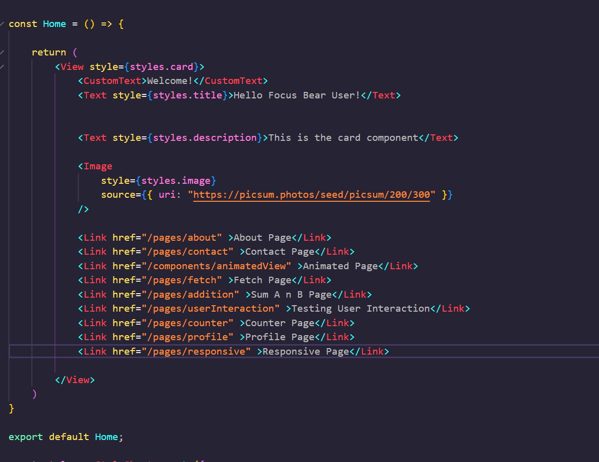
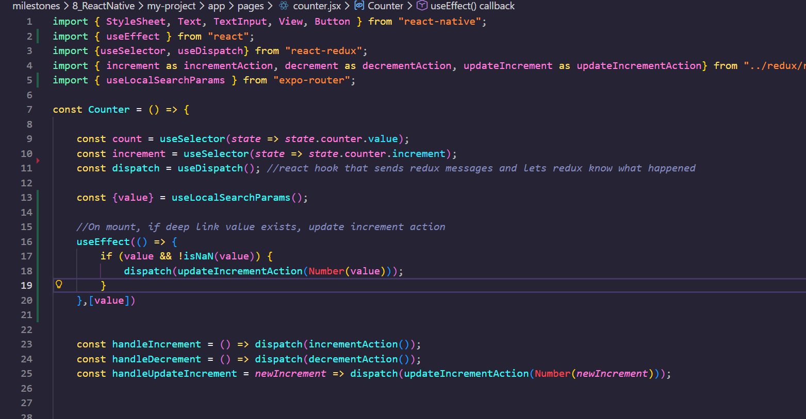
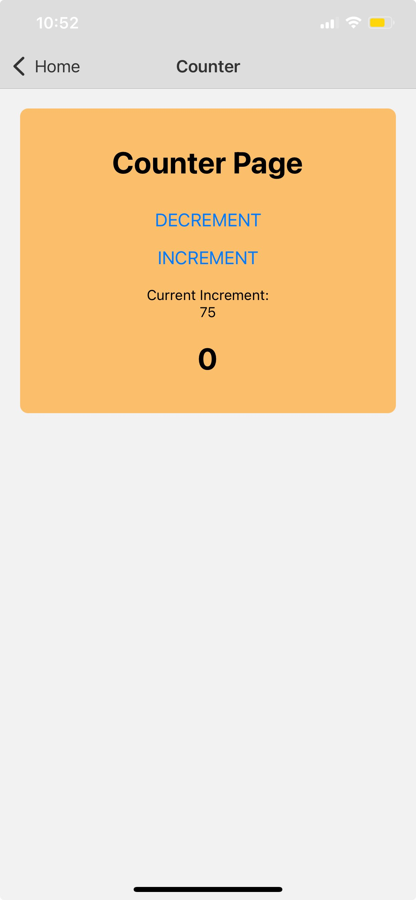

# React Native Navigation

[React Navigation Setup](https://www.youtube.com/watch?v=OmQCU-3KPms)

## Types of Navigation: Tab, Stack and Drawer

1. Stack Navigation

We organise screens in a stack. Each time a user segues into a new screen, the new screen is pushed on top of the stack
and can be popped off to go back to the previous screen.

2. Tab Navigation

Displays screens in separate tabs, usually at the bottom or top of the screen.
Users can quickly switch between sections. This would commonly include  Home, Search, Profile

3. Drawer Navigation

Uses a side panel or side bar (drawer) that slides out to show different routes.

TLDR:
Stack = linear flow (back/forward)
Tab = top-level sections
Drawer = hidden but accessible menu

## How React Navigation handles screen transitions?

React Navigation will use a internal navigation stack and gestures to manage transitions:

- Each screen in the stack is rendered on top of the previous screen
- These transitions are animated automatically. For example, we could have a push, modal or fade out etc. You can customise these transitions.

Navigation state (current route, params, etc.) is stored in React state and updated as users navigate.

## Example of Basic React Native Navigation


This is the Home Page code



This is the Home page (`index.jsx`) that contains the links to other screens or pages. This is a simple navigation stack and I click on the About Page link, I will be redirected to the ABout Page:


The pages are stacked on top of each other:


## How would you implement deep linking in a React Native app?

```
npx expo install expo-linking
```

Deep linking allows external URLs to open specific screens inside the app. For example:

- focusbear://tasks: opens the Tasks screen
- focusbear://settings/stats → opens the Stats section inside Settings

Deep linking improves overall user experience and engagement by:

- Taking users straight to relevant content (no need to navigate manually).
- Enabling cross-app integration (e.g., open your app from a browser or another app).
- Allows for easier campaign and sharing of features

First, we would need to define a linking configuration that maps URL paths to screens in the app.
The app listens for incoming links (custom schemes or universal links). When a link is triggered, React Navigation parses the URL and navigates to the correct route with parameters

Deep linking integrates well with universal links and push notifications, enabling users to jump directly to specific app content.

For example:

1. The user gets a notification about a specific task. "HEY DONT FORGET ABOUT YOUR TASKS/example123"
2. When pressed on, the user is redirected to that task screen and jumps directly to it


Here, we implemented a button that navigates to the counter page where the currentIncrement value is set to 75.





## Challenges setting up deep linking in expo + react native

### Confusion Between Development (Expo Go) and Production Environments

Challenge:
I configured "scheme": "myapp" in app.json, but myapp:// URLs didn't work when using Linking.openURL() inside your app.

Root Cause:
In Expo Go (development), only the exp:// scheme is registered with the device's OS
Our custom myapp:// scheme only gets registered when you build a standalone app
app.json is just a configuration file and it doesn't actively register schemes until build time

What Worked:
External links from Safari using exp://192.168.x.x:8081/--/pages/counter?value=75
Internal navigation attempts using myapp:// failed

So essentially, if I did myapp://pages/counter?value=75, the OS looks for an app that handles myapp but it fails. No app is registered with that scheme (only Expo Go with exp:// is registered and expo go is runnnig the application)

Safari works because when you type exp://192.168.x.x:8081/--/pages/counter?value=5 in Safari:

- iOS recognizes exp:// as registered to Expo Go
- Opens Expo Go app
- Expo Go interprets the rest of the URL and navigates

### Misunderstanding When to Use Linking.openURL()

Challenge:
I tried using Linking.openURL("myapp://pages/counter?value=75") from a button inside your app, which threw an error.

Root Cause:
Linking.openURL() is meant for opening external URLs or launching your app from outside. With Expo Router already set up, you don't need Linking.openURL() for internal navigation. Expo Router automatically handles all deep linking for your routes

TLDR and reccomnedation:

>From the [docs](https://docs.expo.dev/linking/overview/), it says that if your project already has expo-router installed, they recommend using Expo Router since deep linking is automatically enabled for all of your app's screens.


